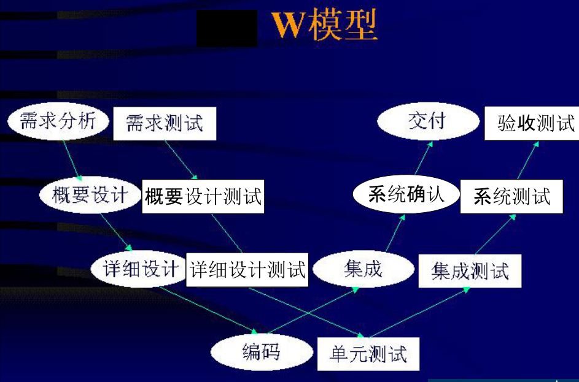
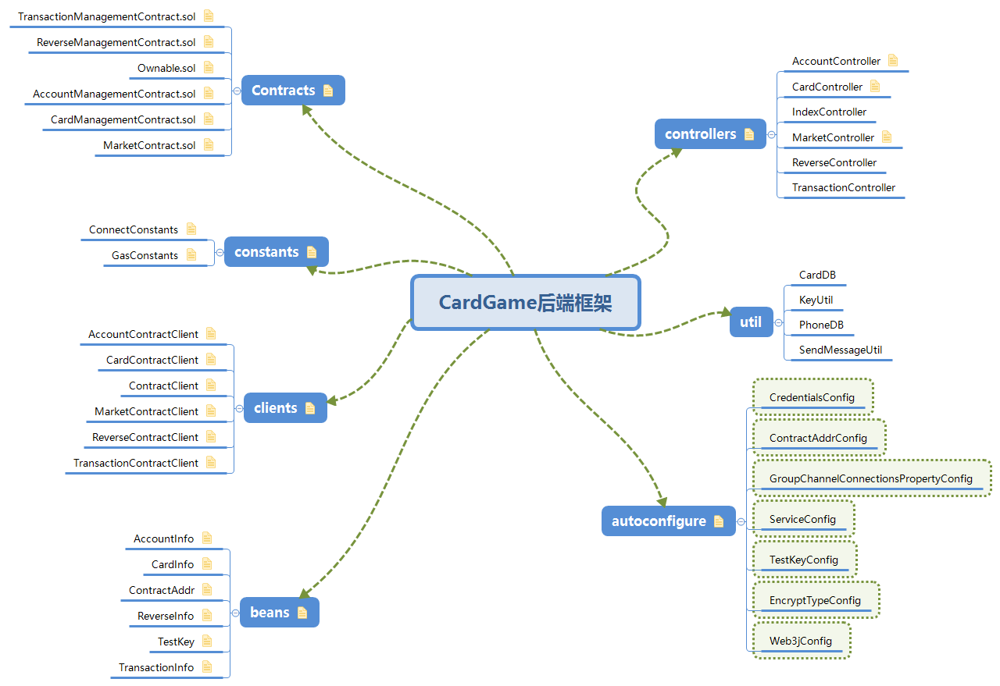

# 		  
测 试 文 档

### 1. 测试人

石望华

### 2. 主要的测试时间

* 7月1日下午
* 7月2日上午
* 7月4日
* 7月5日

### 3. 测试方法

* 由于项目未正式完成，没有具有完整功能的可运行程序，故项目进行中不适合做**黑盒测试**、α和β测试等

- 前端

  * 在浏览器打开进行功能测试
  * 集成测试（大棒集成、自底向上、自顶向下）

- 对后端、合约中的白盒测试

  * 基本路径覆盖、条件组合测试等测试用例方法

  - 静态检测（主要）
  - 走查、同级审查
  - 集成测试（大棒集成、自底向上、自顶向下）

- 合约

  * 静态检查
  * 在remix中进行测试

- 对文档的测试

  * 静态检测

- 测试框架

  Junit（即SpringBootStarter中已搭好的）

- 其他可能用到的测试

  * 错误推测法
  * 边界值分析法
  
  * 回归测试
  * 冒烟测试
  * 安全性测试
  * 验收测试
  * 用户界面和可用性测试

### 4. 测试模型

### 5. 测试要检测的bug

* Data reference errors

  数据引用错误

* Data declaration errors

  数据声明错误

* Computation errors

  计算的逻辑错误

* Input/Output errors

  输入、输出的错误（包括传参）

### 6. 测试不需要检测出的bug

* 汉字写错
* 变量名命名不合适
* 没有引用但导入了的包

### 7. 测试原则

* 不求进行穷举测试
* 测试贯穿项目全过程
* 基于“质量第一"的思想去测试，当时间和核心质量冲突时，时间要服从质量
* 坚持二八原则，百分之80的缺陷集中在百分之二十的功能上
* 有时候难以确定bug是不是真的是bug

### 8. 实际测试过程

* 前端
  * 主要是写前端人员（全体队员）边改边测（直接看界面），以实现基本功能为主；
  * 涉及到后端通信的逻辑代码部分，如果暂时连不上后端，就绕过向后端发请求的代码，直接在本地设置或获取简易版数据进行对界面基本展示的测试
* 后端
  * 后端人员（李冠海）写了个测试程序，进行了完整的功能测试
  * 测试人员（石望华）读代码、写下面的测试记录与bug跟踪
* 合约
  * 对后端的测试应该是包括了对合约的功能测试
* 文档
  * 测试人员（石望华）静态检查

#       
测试记录&&bug跟踪

##                                         静态检测

## (1) 后端

* 总体来说，几乎所有的代码都缺乏注释，使代码可读性低，不利于后续开发、更改需求后的变更实现；

### 1. /src/main/java/org.fisco.bcos/autoconfigure

* 除了EncryptTypeConfig.java类有写set方法，其他6个类全没有提供set方法

  后来发现是注解@data的使用可以省略set和get函数，建议EncryptTypeConfig.java统一风格

* ServiceConfig.java
  
  * groupId应该和orgID一样通过注解从application.yml文件的channel-service里获取，而不是硬编码的方式直接设置为1

### 2. /src/main/java/org.fisco.bcos/beans

* 除了ContractAddr.java其他五个类的数据成员全没有声明成private

### 3. /src/main/java/org.fisco.bcos/clients

* 从MarketContractClient.java的buyCard可知credentials的地址是当前登录用户的地址（买家），而这个地址是在虚类中定义与赋值的，同时被所有的合约代理类共享，可能有些不合理，比如CardContractClient.java就没用到当前用户的地址

### 4. /src/main/java/org.fisco.bcos/controllers

* AccountController.java没有实现addAccount的接口，只有get账户信息的接口

------

## (2) 项目详细设计文档

* 功能性需求中卡片设置中的“特定立绘”不清楚什么意思，表意不明；卡片星通过用户输入一段话来确定，不清楚这种功能的逻辑，一张卡片的星数应该是确定的；
* 详细设计文档里不应有抽取算法实现代码，而且实现代码中的**cashId**是凭空出现的，未看到声明与赋值；
* 主场景时序图的购买卡片场景中应该在创建并增加交易、修改账户余额后再改变卡片的持有者，而不是一开始就改变持有者；抽卡场景中没有第5步但是出现了第6步；
* 文档中的错别字这里不再详细指出；
* 逻辑部署方案中缺少第4-9步；

# 后端框架

