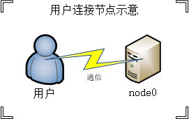
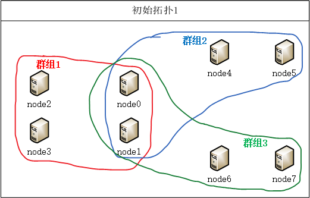
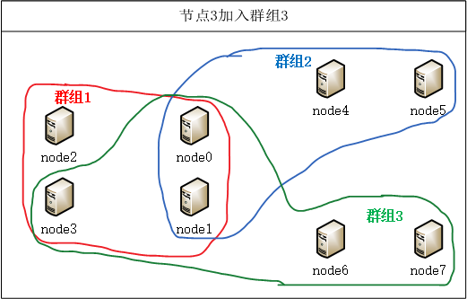
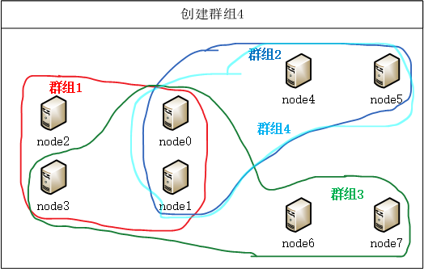
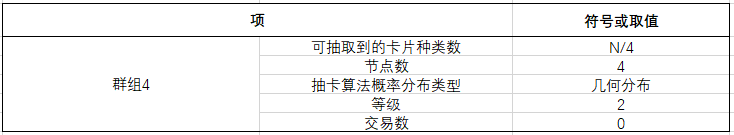

#         
类比特币概要设计

###           
（应用多群组架构：星形拓扑+并行多组）

### 1. 基于以下基本设想

* 将卡片视为具有等级的比特币，将 “挖比特币” 的过程简化为 “抽卡” 的操作
* 卡片分6个等级，等级越高，价值越高，越难抽到
* 将节点视为一个商店或者服务中心或者服务器，将群组视为一个社区，用户可通过登录（连接到）一个群组里的某个节点进行各种交易
* 用户进行一次抽卡操作可能什么都没抽到（越到后面越难抽）
* 一个群组对应一种抽卡算法，这种算法使得单个群组里可以抽到的卡片类型是有限的，为了抽到更为稀有的卡片，用户可以申请纳入新的群组（**节点加入群组**）
* 一种抽卡算法可以考虑对应一种随机概率分布（0-1分布、二项分布、几何分布、超几何分布 、泊松分布、均匀分布、正态分布、指数分布等等），一次抽两张卡时可以对应二维随机正态分布等，每一种分布只能作用于卡片集的一个真子集上
* 单个节点加入群组的耗费是昂贵的，同一个社区（群组）的用户可以通过共享一个新的算法来获取更稀有的卡片，即基于一个现有群组的所有节点创建一个新的群组（**并行多组**）
* 考虑 “等级社区” 的概念，一个社区的等级对应这个社区能抽到的卡片的最高等级，社区可以进行升级

### 2. 拓扑示例图

#### 2.1 用户通过前端登录群组中的某一节点

#### 2.2 初始拓扑示例图

#### 2.3 节点加入群组

* node3节点申请加入群组3, 以获得抽到更稀有卡片的机会

* 群组3的节点数变为5，node3同属两个群组，可以抽到群组3中可以提供的卡片了。

#### 2.4 并行多组

* node0、node1、node4、node5申请创建群组4

  

