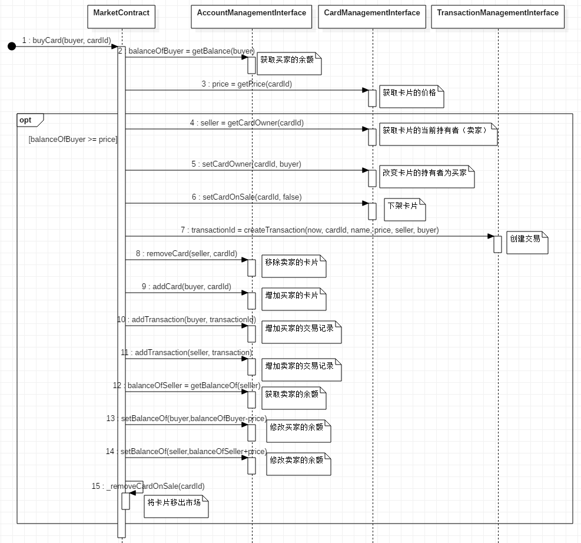
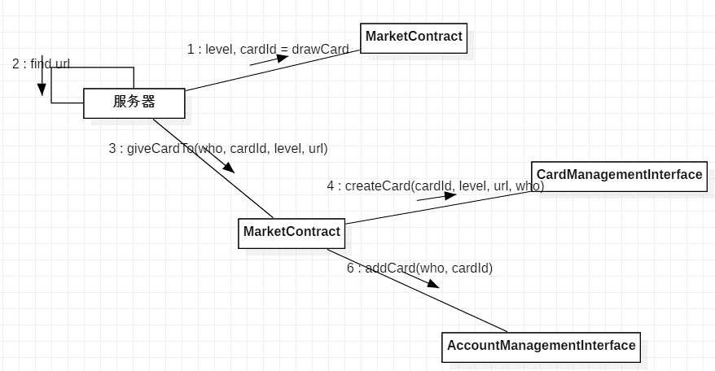
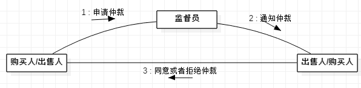
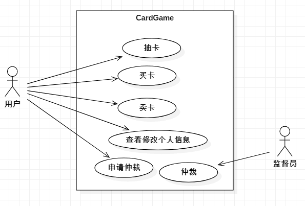
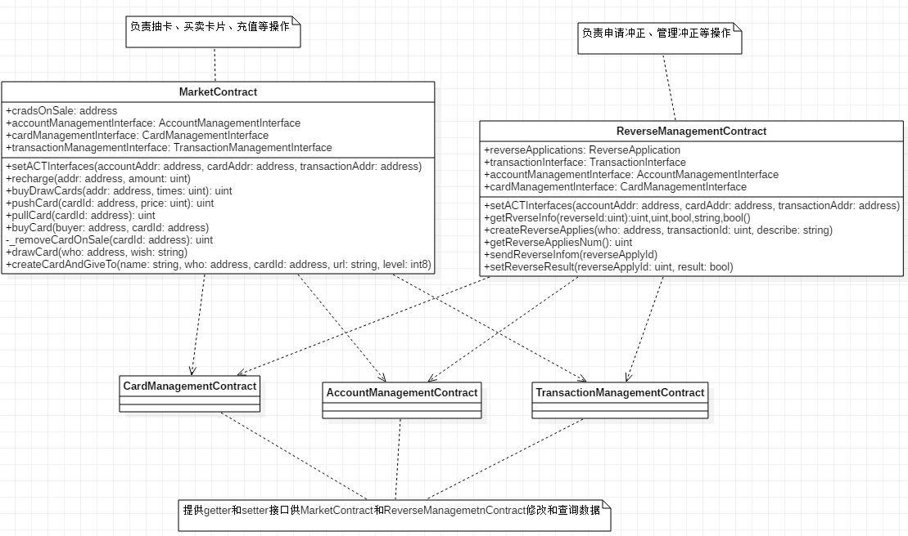
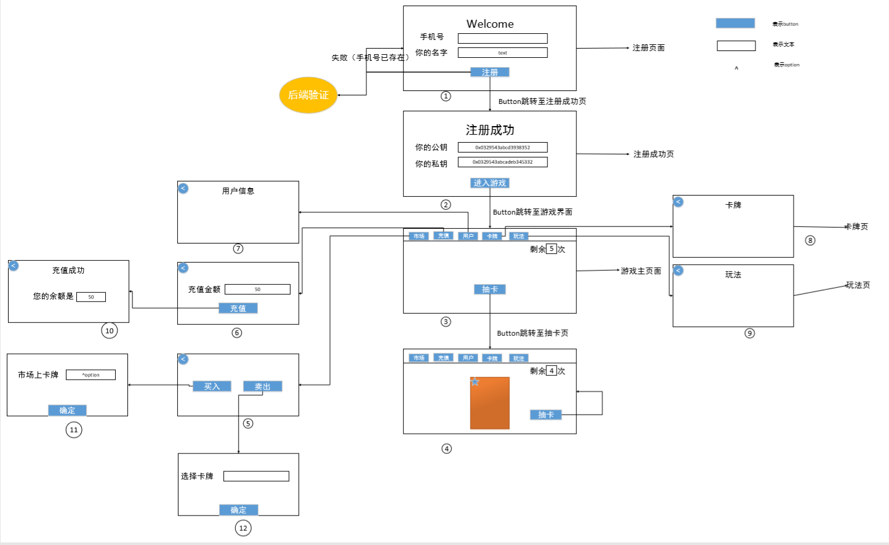

# 详细设计文档
-----------------------
课程名称|企业软件项目实训
-|-
项目名称|集换式卡片游戏平台
学生姓名|队长：陈思源   队员：李冠海、石望华、张羽颀、贾学雨
学生专业|软件工程
开课学期|2018-2019第二学期

 

## 需求分析
### 需求概述
一个集换式卡片游戏平台，玩家可在该平台通过Hash随机算法抽取不同等级的卡片（卡片星级越高，价值越高，获取难度越大），玩家可以通过卡片市场出售所持有卡片或者从卡片市场通过平台货币购买卡片。
平台货币可充值购买，也可提现，玩家可以支付平台货币购买卡片抽取资格。
### 功能性需求
需求名称|需求描述
-|-
用户注册|登陆界面，填写用户名、手机号，获取验证码并验证，通过后获得公钥和私钥，用户创建成功。（同一手机号不能重复注册）
用户登陆及信息显示|用户通过自己的私钥登陆。登陆后从区块链上返回用户信息，前端显示用户信息。
抽卡资格获取|新创建用户可免费获得5次免费抽卡资格，用户可以通过支付平台货币购买抽卡资格。
用户充值|用户可通过向平台支付，兑换平台货币。
抽卡|拥有抽卡资格的用户可以抽取卡片，抽取结果由随机算法生成，卡片加入用户卡组。
卡片交易|用户可以将自己卡组中的卡片在卡片市场出售以赚取平台货币，也可以使用平台货币在卡片市场购买卡片。交易达成后，卡片由卖方用户卡组转移至买方用户卡组。
查看交易历史|用户可以查看自己的交易历史，并对希望撤销的交易申请仲裁
市场仲裁|交易纪录仅写入用户链上，用户可以调用链上合约获取自己的交易纪录，如果对某项交易不满意，可以像监管员发起仲裁，监督员可获取交易双方地址，像双方发送交易撤回确认。买卖双方授权确认撤回后，仲裁成功，交易回溯。
用户信息更改|用户可以修改个人信息。
卡片设置|卡片需要有特定立绘（卡片之间可能相同，公开立绘获取随机算法），每张卡片应有独一ID(uint)。卡片分为一星至六星六等，星等越高越难获取。卡片星等计算通过用户输入一段话加上获取当前时间秒数（自1970.1.1），传入根据相应算法生成。

#### 各等级概率表
等级|概率
-|-
1|	0.5889
2|	0.3
3|	0.1
4|	0.01
5|	0.001
6|	0.0001

#### 抽取算法实现代码（合约内）
    	    /1: 0.5889 ==> 5889   
    	    //2: 0.3000 ==> 8889  
    	    //3: 0.1000 ==> 9889  
    	    //4: 0.0100 ==> 9989  
    	    //5: 0.0010 ==> 9999  
    	    //6: 0.0001 ==> 10000  
    	    uint nonce = 0;  
    	    function drawCard(address who, string wish)external{  
      	        require(accountManagementInterface.getDrawCountOf(who) > 0);  
      	        uint cardIdInt = uint(keccak256(abi.encodePacked(wish))) +   
      	                uint(keccak256(abi.encodePacked(now, msg.sender, nonce)));  
      	        uint rand = cardIdInt % 10000 + 1;  
      	        address cardId = address(cardIdInt);  
      	        nonce++;  
      	        int8 level = 0;  
      	        if(rand <= 58889){  
        	            level = 1;  
        	        }else if(rand <= 8889){  
          	            level = 2;  
          	        }else if(rand <= 9889){  
            	            level = 3;  
            	        }else if(rand <= 9989){  
              	            level = 4;  
              	        }else if(rand <=9999){  
                	            level = 5;  
                	        }else{  
                  	            level = 6;  
                  	        }  
                  	        emit DrawCardEvent(level, cardId);  
                  	    }  

#### 非功能需求
需求名称|需求描述
-|-
安全性|功能函数由区块链合约实现，代码公开。仅用户能查看自身资产，平台没有接口可以调用相关信息。
隐私性|市场交易，买方和卖方之间互相匿名，交易仅由合约调用自动完成。

#### 主要场景
##### 1)	购买卡片（时序图及接口）

##### 2)	抽取卡片（通信图）

##### 3)	交易仲裁（通信图）

#### 角色分析
   
用户：管理个人信息，抽取卡片，买卖卡片，申请交易仲裁。   
监管员：处理仲裁申请，通知交易双方。

## 系统设计
### 智能合约
i. AccountManagementContract（用户管理合约）  
ii. CardManagementContract(卡片管理合约)  
iii. MarketContract(市场合约)
iv. ReverseManagementContract（仲裁合约）   
v. TransactionManagementContract（交易管理合约）  
vi. Ownable

### 页面设计

## 逻辑部署方案
 
