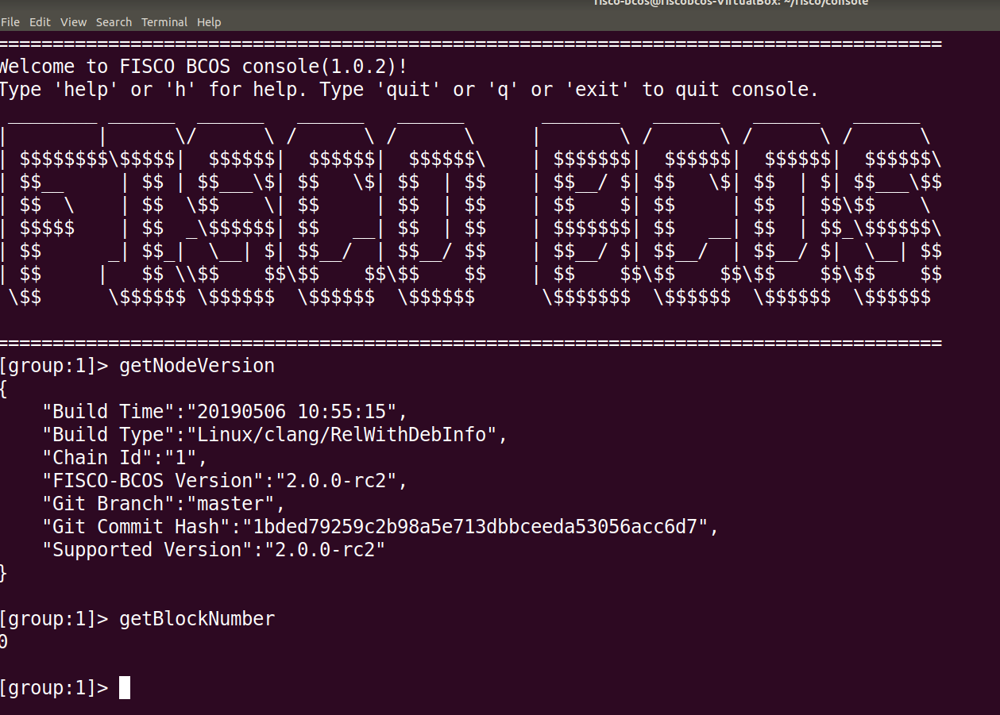
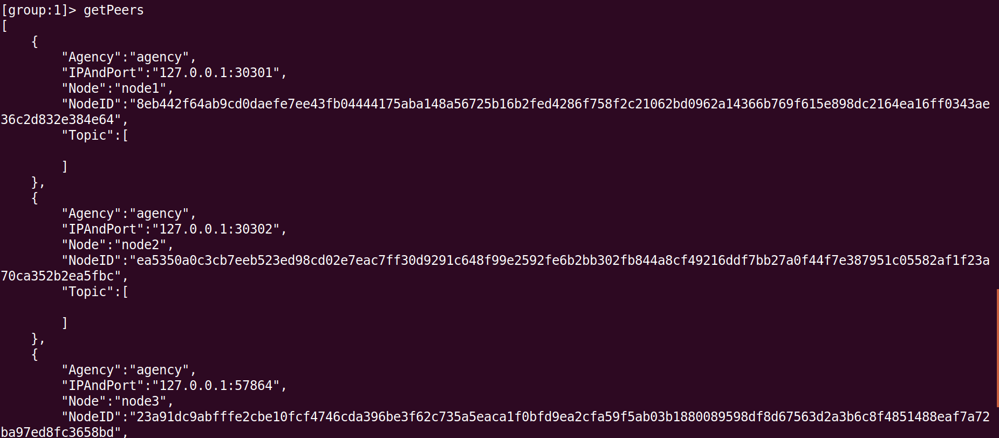
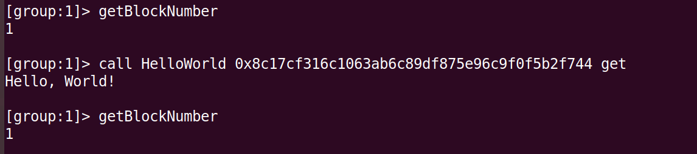
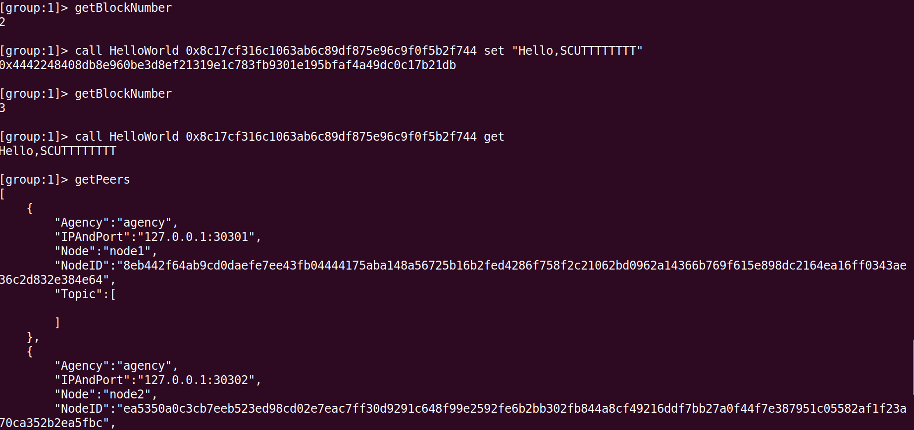
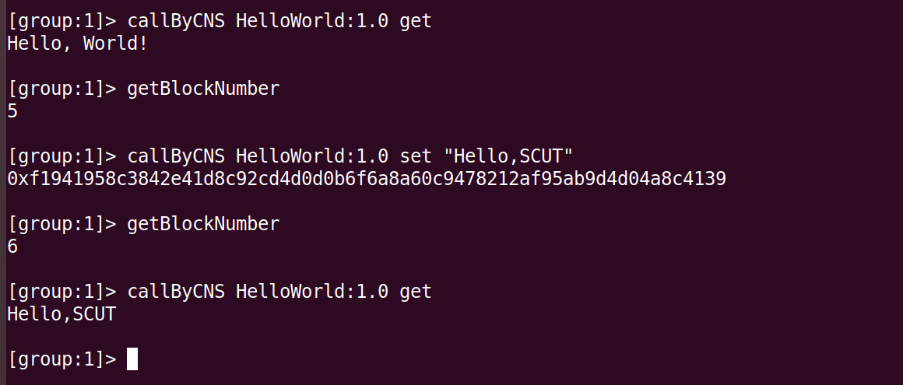

# DAY 1 课堂作业结果截图展示

### 1.查看区块高度

### 2.获取区块数据

### 3 and 4 : 部署HelloWorld合约并查看log

### 5 and 6 : 调用智能合约，并对比前后区块高度
 *  首先调用call_get，发现区块高度没有改变    
 
 * 然后调用set方法，发现区块高度增加
 

### 7. 再次获取数据，已经被set方法改变

### 8 and 9 : 按CNS方法部署HelloWorld智能合约，并对比前后区块高度变化

### 10. 再次获取区块数据

