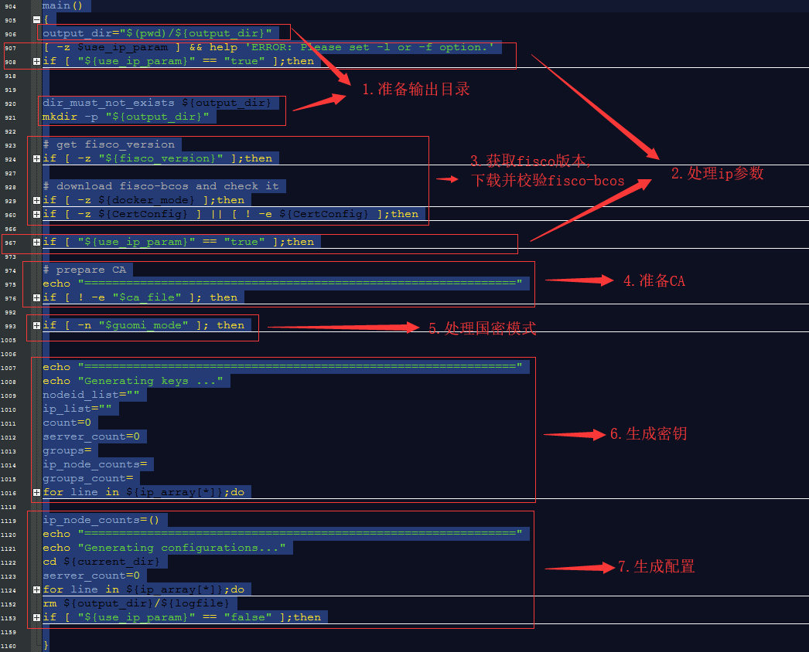

# build_chain.sh代码分析
build_chain.sh的代码可以分为三部分：声明和定义全局变量、定义函数、调用函数
### 声明和定义全局变量
代码中第5到第36行声明和定义了31个全局变量，有的变量有初始值，如log_level初始值是'info'，共享算法类型consensus_type初始值是'pbft'等；有的变量没有初始值，如操作系统类型(OS)等。它们的值大部分都会在后面的过程中确定或者被修改，主要是在parse_params()方法中确定或者修改，这个方法确定或者修改了以下19个全局变量的值:    
1. ip_file    
ip文件，用来存储ip、机构、群组信息的文件，通过-f选项指定，如果有指定则use_ip_param参数会被赋为false   
2. ip_param   
ip参数，用来指定服务器的ip地址以及节点数，通过-l选项指定，如果有指定则use_ip_param参数会被赋为true    
3. use_ip_param   
是否使用ip参数，true表示通过命令行参数指定ip，false表示通过ip文件指定ip    
4. output_dir   
输出路径，通过-o选项指定，默认是nodes   
5. listen_ip    
主机的ip地址，通过-i选项修改，如果没有-i选项，则默认是127.0.0.1；如果有-i选项，则为0.0.0.0   
6. fisco_version    
fisco-bcos的版本，通过-v选项指定    
7. port_start   
p2p端口、channel端口和jsonrpc端口，通过-p选项指定    
8. bin_path   
fisco-bcos二进制文件的路径，通过-e选项指定，默认是从github上下载   
9. state_type   
通过-s选项指定，默认是storage，用-s可指定为mpt    
10. storage_type    
通过-S选项指定，默认是leveldb，用-S可指定为external   
11. CertConfig    
证书的配置文件，默认情况下是自动生成的，也可以通过-t选项指定配置文件   
12. consensus_type    
共识算法类型，默认是pbft，用-c选项可修改为raft共识算法    
13. chain_id    
区块链的id，默认是1，通过-C选项可以指定一个无符号整数作为区块链id    
14. debug_log   
是否开启调试日志，默认是关闭的，用-T选项开启   
15. log_level   
日志的等级，默认是info，在用-T选项开启调试日志时会被修改为debug    
16. auto_flush    
是否自动刷新日志，默认自动刷新，用-F关闭自动刷新   
17. make_tar    
是否将pwd/ip_addr文件夹打包成pwd/ip_addr.tar.gz，默认不打包，如果要打包则使用-z选项   
18. guomi_mode    
是否使用国密模式，默认不使用，用-g选项表示使用国密模式    
19. docker_mode   
是否使用docker模式，默认不使用，用-d选项表示使用docker模式    

### 定义函数
代码中第38到第1160行定义了33个函数，如果按照功能来划分的话，大概可以分为六类：
###### 用来打印信息的函数
1. help()   
打印帮助信息
2. LOG_WARN()    
打印警告信息
3. LOG_INFO()   
打印普通信息
4. print_result()    
打印脚本的执行结果
5. fail_message()    
打印失败信息，并终止脚本

###### 用来检验是否满足某些条件的函数
1. check_env()    
主要检查openssl的版本(1.0.2或者1.1)以及操作系统类型(macOS或者Linux)
2. check_and_install_tassl()   
TaSSL是国密版OpenSSL，这个函数主要检查是否有已经安装TaSSL，如果没有则下载并安装TaSSL    
如果在命令行参数中有指定国密模式，那么在main函数中就会调用这个函数
3. check_name()    
用来判断名字是满足正则表达式^[a-zA-Z0-9.\_-]+$，在后面生成证书的时候会多次使用到

###### 用来判断文件或者目录是否存在的函数
1. file_must_exists()   
判断文件是否存在，如果不存在则输出提示并结束脚本
2. dir_must_exists()   
判断目录是否存在，如果不存在则输出提示并结束脚本
3. dir_must_not_exists()   
判断目录是否存在，如果存在则输出提示（删除旧的目录）并结束脚本

###### 用来生成证书、密钥、配置文件的函数
1. gen_chain_cert()   
生成区块链私钥和证书：   
pwd/nodes/cert/ca.key    
pwd/nodes/cert/ca.cert   
将cert.cnf移动到pwd/nodes/cert/里    
2. gen_chain_cert_gm()    
生成国密版区块链私钥和证书
3. gen_agency_cert()    
生成机构私钥和证书：   
pwd/nodes/cert/agency/agency.key    
pwd/nodes/cert/agency/agency.crt    
将ca.crt和cert.cnf复制到pwd/nodes/cert/agency/里    
然后用ca.crt和agency.crt生成ca-agency.crt   
4. gen_agency_cert_gm()   
生成国密版机构私钥和证书   
5. gen_node_cert()    
生成节点id、私钥和证书：   
pwd/nodes/ip_addr/node\*/conf/node.crt    
pwd/nodes/ip_addr/node\*/conf/node.key   
pwd/nodes/ip_addr/node\*/conf/node.nodeid    
将ca.crt和agency.crt复制到pwd/nodes/ip_addr/node\*/conf/里   
6. gen_node_cert_gm()   
生成国密版的节点私钥和证书   
7. gen_cert_secp256k1()   
在gen_node_cert函数中被调用，用椭圆曲线加密算法生成节点的私钥和证书    
8. gen_node_cert_with_extensions_gm()   
在gen_node_cert_gm函数中被调用，用来生成国密版节点私钥和证书    
9. generate_gmsm2_param()   
在gen_chain_cert_gm函数中被调用，用来辅助生成国密版区块链私钥和证书    
10. generate_config_ini()   
生成节点的配置文件：    
pwd/nodes/ip_addr/node\*/config.ini   
11. generate_group_genesis()    
生成群组的genesis文件：   
pwd/nodes/ip_addr/node\*/conf/group.1.genesis   
12. generate_group_ini()    
生成群组的配置文件   
pwd/nodes/ip_addr/node\*/conf/group.1.ini   
13. generate_cert_conf()    
生成区块链证书的配置文件：    
pwd/nodes/cert.cnf    
之后这个文件会在gen_chain_cert函数中被移动到pwd/nodes/cert/里面，在gen_agency_cert函数中被复制到pwd/nodes/cert/agency/里    
14. generate_cert_conf_gm()   
生成国密版区块链证书的配置文件   
15. generate_script_template()    
生成节点脚本的模板，这个函数会在后面的 generate_node_scripts、genTransTest和generate_server_scripts这三个函数中被调用，作用就是为每个生成的脚本文件的一开始加上下面这两行代码：    
```bash
#!/bin/bash
SHELL_FOLDER=\$(cd \$(dirname \$0);pwd)
```   
并且把脚本文件的权限改成+x    
16. generate_node_scripts()   
生成节点的脚本，也就是pwd/nodes/ip_addr/node\*/文件夹里的nohup.out、start.sh和stop.sh这三个文件    
17. genTransTest()    
生成pwd/nodes/ip_addr/.transTest.sh，它是一个隐藏文件   
18. generate_server_scripts()   
生成服务器脚本，也就是pwd/nodes/ip_addr/文件夹里的start_all.sh和stop_all.sh这两个文件    

###### 用来解析的函数
1. parse_params()   
解析命令行参数，总共有18个选项，help函数中给出了这18个选项的作用，如-C用来设置生成的区块链的id，-f用来指定ip文件，而如果有-c则使用Raft共识算法，没有-c则默认使用PBFT共识算法......
2. parse_ip_config()   
解析ip配置：如果命令行参数中有指定ip文件，那么在main函数中就会调用这个函数，然后从文件中读取ip

###### 其他函数
1. getname()    
根据路径生成名字。这个函数主要是使用openssl生成证书的时候用到的。在使用openssl生成证书的时候，可以使用-subj选项指定生成的证书请求的用户信息。而getname就是根据文件的路径来生成常用名(CN, CommonName)，比如：   
```bash
....
name=$(getname "$agencypath")
....
openssl .... -subj "/CN=$name/O=fisco-bcos/OU=agency" ....
....
```
2. main()    
main函数，大部分操作是在main函数中发生中，大概可以分为七部分，如图：    
   
    1. 准备输出目录   
    确保输出目录不存在，并且创建目录。默认的输出目录名是nodes，可以通过-o选项指定目录名。
    2. 处理ip参数   
    可以通过-l选项从命令行给出ip地址（可以有多个，用逗号分隔），也可以通过-f选项从指定的文件给出ip地址。有多少个ip地址，就有多少个agency和group；如果是用命令行参数给出ip地址，那么agency默认是"agency"，group默认是1；根据参数或者文件得到ip_array，后面会对每个ip都执行操作。
    3. 获取fisco版本、下载并校验fisco-bcos  
    可以通过-v选项指定fisco的版本，如果没有指定版本，那么默认使用master版本。
    4. 准备CA   
    如果CA文件已经存在，那么就会跳过这一步。如果不存在的话，首先，它会先确保${output_dir}/chain目录不存在，然后调用gen_chain_cert生成区块链的证书，然后再调用gen_agency_cert为每个机构生成证书。
    5. 处理国密模式   
    如果使用-g选项，那么就会使用国密模式。首先，它会先检查并安装TaSSL，然后调用generate_cert_conf_gm生成国密版的证书配置，然后调用gen_chain_cert_gm生成国密版的区块链证书，最后调用gen_agency_cert_gm生成国密版的机构证书。
    6. 生成密钥   
    7. 生成配置

### 调用函数
代码的最后依次调用了四个函数：check_env、parse_params、main、print_result   
- 首先先检查环境
- 然后解析命令行参数
- 之后执行main方法
- 最后打印执行的结果
