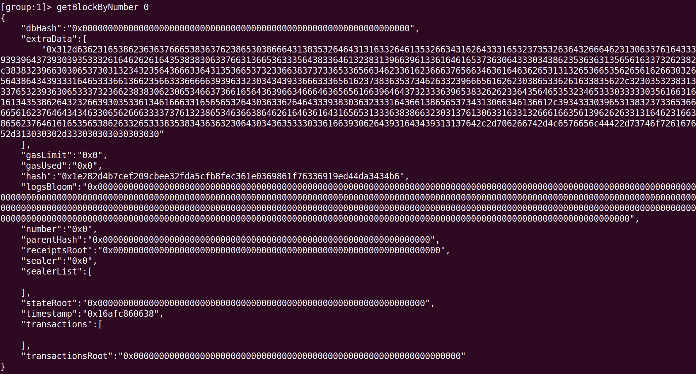
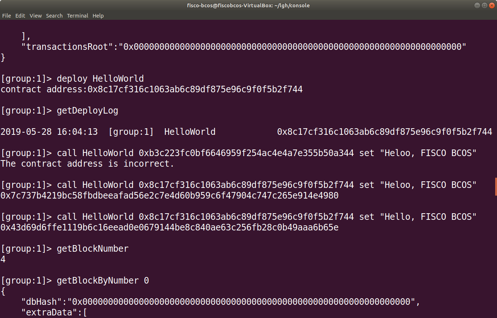
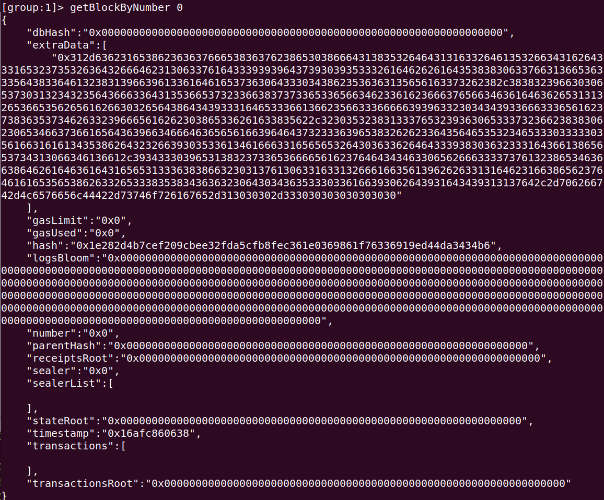
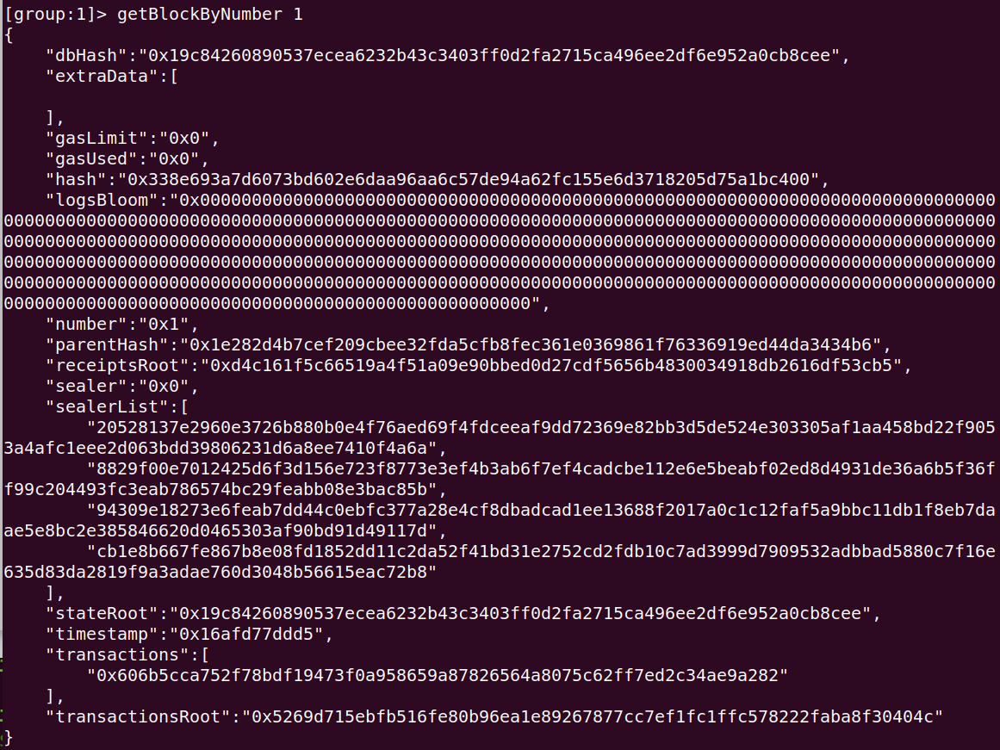
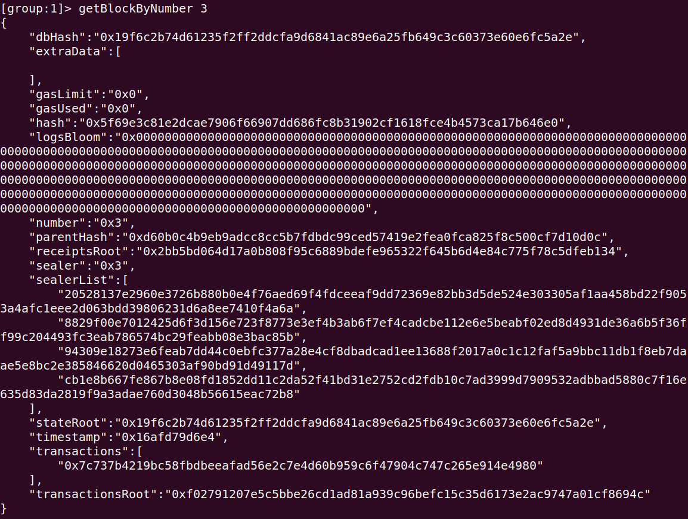
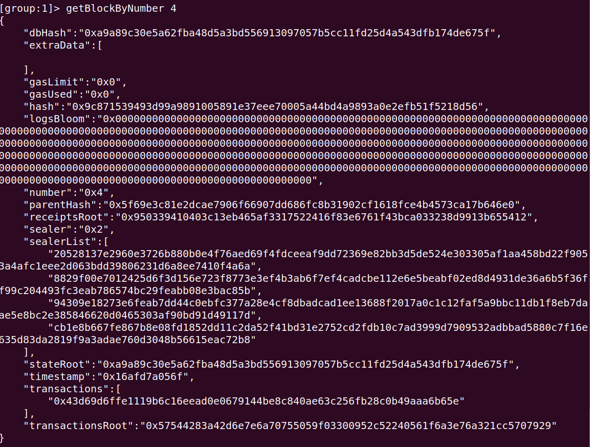
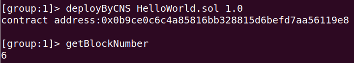
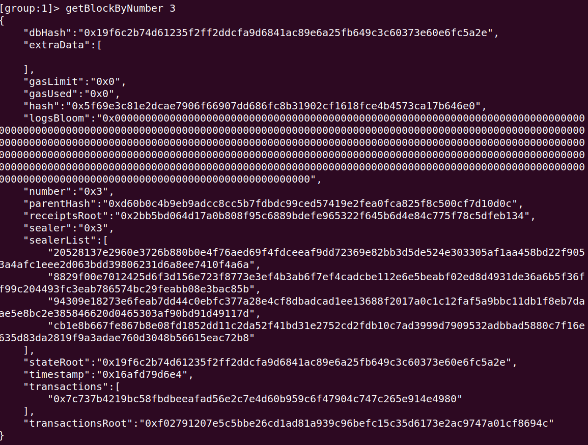
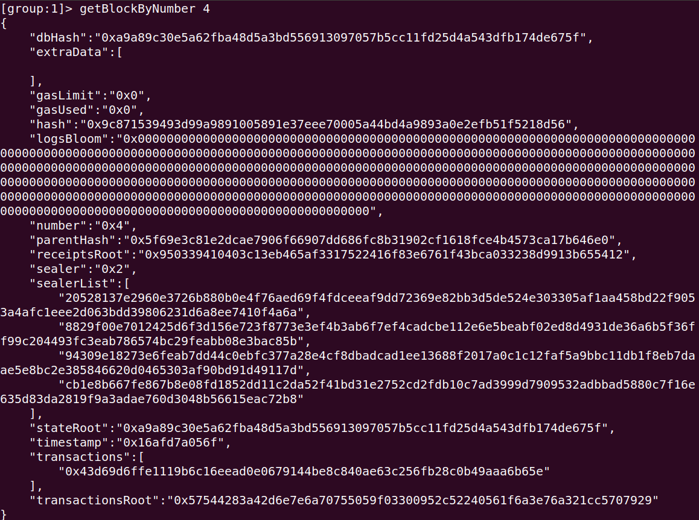
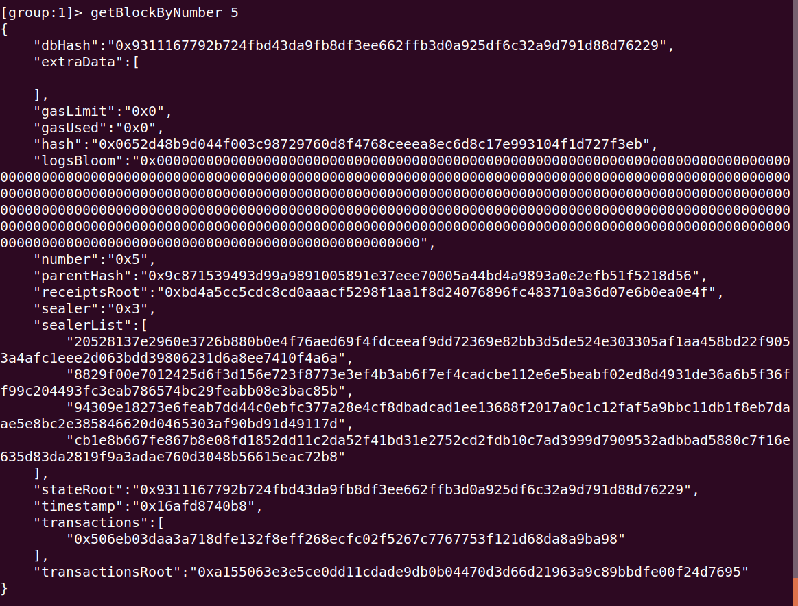

### 1. 查看区块高度
  
通过getBlockNumber命令获取区块的高度，目前只有一个区块，即创始区块
### 2. 获取区块数据

通过getBlockByNumber方法获取指定高度的区块的数据，“0”表示第0个区块
### 3、4、5、6. 部署HelloWorld智能合约、使用查看getDeployLog、调用智能合约 、再次查看区块高度

通过deploy命令部署智能合约，得到合约的地址   
通过getDeployLog命令查看部署日志  
通过call命令+合约名称+合约地址+合约中的方法名+方法的参数来调用合约   
这里一共调用了三次set方法，其中第一次的call命令的合约地址是错误的  
最后再次查看区块高度，可以发现高度已经更新为4，说明部署合约及3次调用智能合约均产生区块
### 7. 获取区块数据
- 第0个区块数据

- 第1个区块数据

- 第2个区块数据

- 第3个区块数据

- 第4个区块数据

### 8、9. 按CNS方式部署HelloWorld智能合约、再次查看区块高度

通过deployByCns+合约名称+合约的别名来部署合约   
（之后可以通过callByCNS+合约名称:合约别名来调用合约）  
然后通过getBlockNumber查看目前区块高度，发现变为6，说明deployByCNS命令在部署合约时增加了两个区块
### 10. 获取区块数据
- 第0个区块数据

- 第1个区块数据

- 第2个区块数据

- 第3个区块数据

- 第4个区块数据

- 第5个区块数据

- 第6个区块数据

