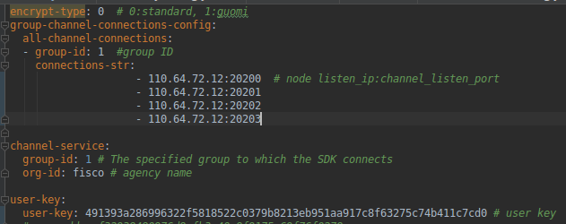
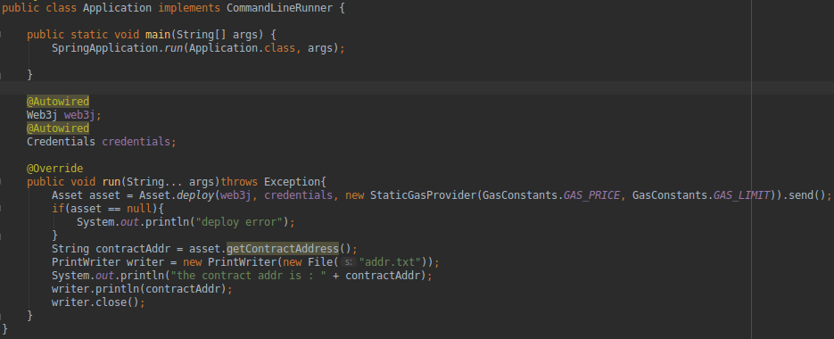
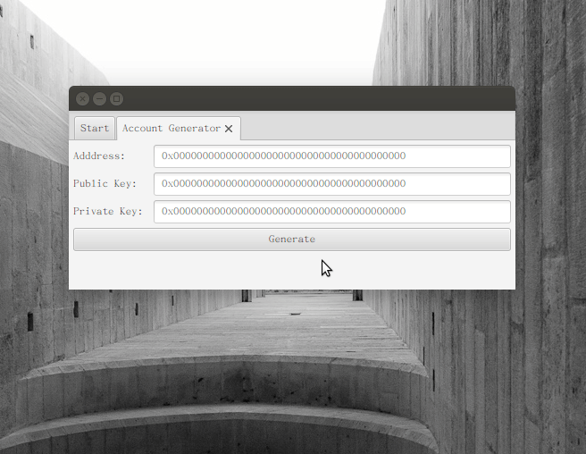
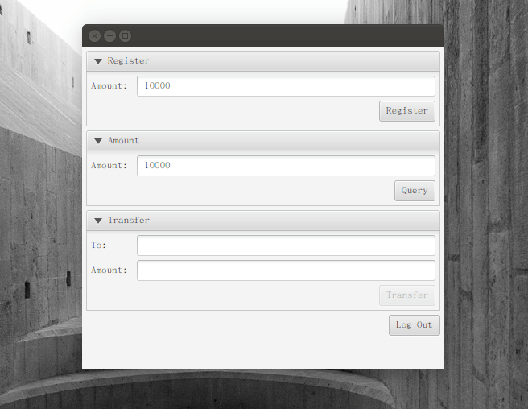

# Asset App
**1. 物理环境：**    
机器A（110.64.72.12）：用来部署区块链和节点    
机器B（110.64.72.14）：用来开发JavaFX应用    
**2. 用以下命令在机器A上搭建有4个节点的区块链：**   
```bash
$ ./build_chain.sh -l 110.64.72.12:4 -i
```
ip地址使用机器A的ip地址    
加上-i选项允许外网访问    
然后启动所有节点    
**3. 使用文档给出的完整代码作为智能合约：[Asset.sol](https://fisco-bcos-documentation.readthedocs.io/zh_CN/latest/docs/tutorial/sdk_application.html)**   
**4. 用控制台工具将合约转换为java类Asset**    
**5. 在机器A上部署合约，并保存合约的地址：**   
在spring-boot-starter的基础上修改配置中的connections-str：    
   
然后编写用来部署合约的代码：    
    
主要就是调用deploy方法将Asset合约部署到链上，然后把合约地址写到addr.txt中保存起来    
**6. 在机器B上开发JavaFX应用**    
同样先修改application.yml中的connections-str，将ip改为机器A的地址110.64.72.12   
对合约类Asset进行封装得到[AssetClient.java](./asset-manager/src/main/java/org/fisco/bcos/contract/AssetClient.java)    
根据DAY2-3.实验.pdf中UserKeyUtils创建UserKeyUtils类，用来生成地址和公、私钥   
然后编写JavaFX应用：[JFXApplication.java](./asset-manager/src/main/java/org/fisco/bcos/JFXApplication.java)    
**7. 使用说明**   
启动时可以通过私钥进入，如果没有私钥，可以生成私钥：    
    
生成私钥、注册资产并查询资产：   
    
进行转账并查询转账后的资产：    

