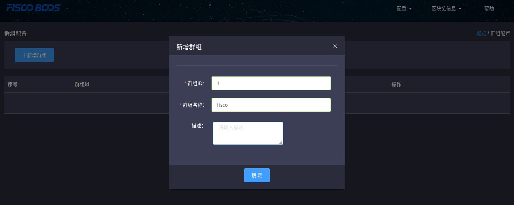
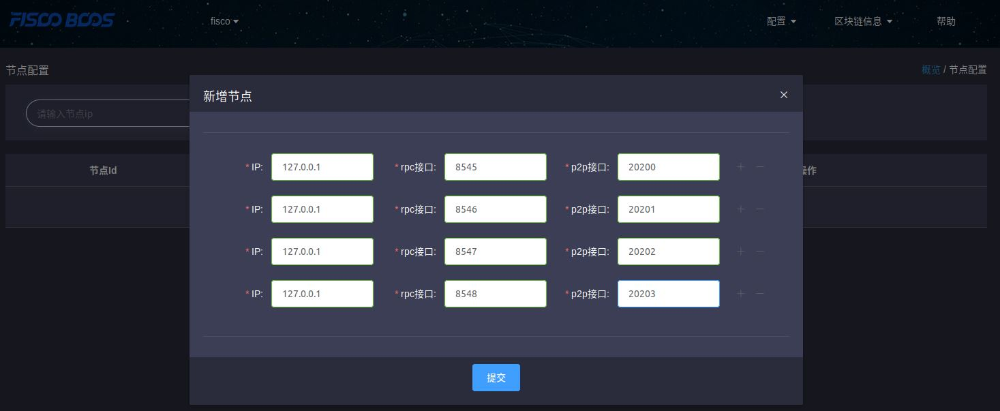
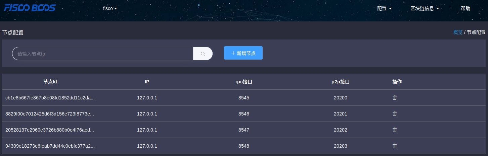
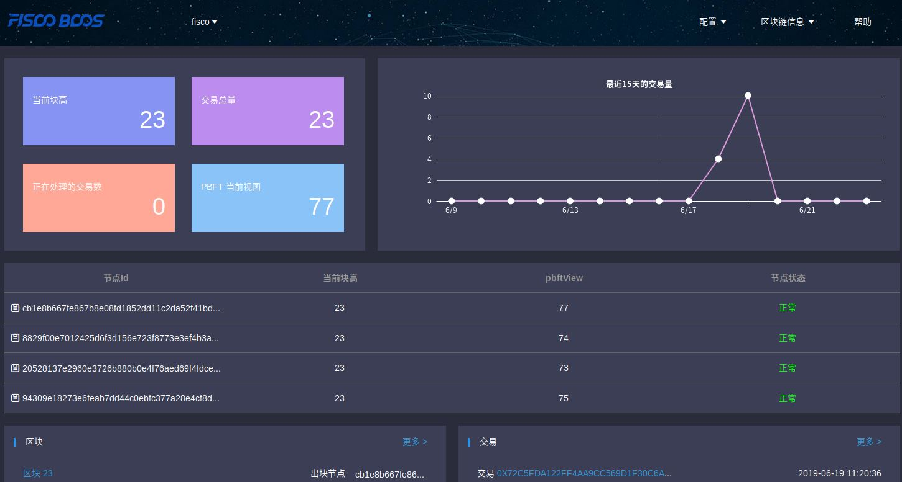

# 区块链浏览器
1. 搭建环境   
下载fisco-bcos-browser  
安装python2、mysql、MySQL-python    
将common.properties中的mysql.user和mysqle.password的值改为root    
进入deploy文件夹   
**问题1：** 执行python deploy.py run语句时报错，没有run这个操作   
改为python deploy.py startAll   
**问题2：** 连接mysql被拒绝   
通过查找资料，发现是新版mysql认证方式导致的问题    
新版mysql使用的caching_sha2_password，换成mysql_native_password就可以连上了   
也就是执行以下语句   
ALTER USER 'root'@'localhost' IDENTIFIED WITH mysql_native_password BY 'root';    
**问题3：** 不支持平台   
check.py的installByYum方法抛出异常，说不支持这个平台，然而平台确实是ubuntu，于是查看utils.py里的isUbuntu方法，发现有一个platformStr变量，它的值是通过platform.platform()得到的。于是在python控制台中执行platform.platform()方法，发现返回值不是ubuntu，而是debian：    
Linux-4.18.0-22-generic-x86_64-with-debian-buster-sid   
然而操作系统用的是助教老师给的虚拟机文件......    
于是在utils.py里加上一个方法：   
```python
def isDebian():
  return platformStr.lower().find("debian") > -1
```
同时修改installByYum方法（兼容debian）：   
```python
def installByYum(server):
  ......
  elif isUbuntu() or isDebian():
  .....
```   
**问题4：** 可以启动web，无法启动server    
通过查看代码，发现是通过执行server/start.sh文件来启动服务器，于是单独执行start.sh：   
```bash
sudo ./server/start.sh
```   
发现报错，提示找不到/bin/jps    
查看start.sh的代码，发现用到了JAVA_HOME环境变量    
通过echo $JAVA_HOME检查环境变量，发现没有问题    
尝试直接在start.sh定义JAVA_HOME=/opt/jdk1.8.0_211，再执行一遍，发现执行成功   
于是执行deploy.py的startAll，成功启动server和web    
2. 使用浏览器    
先启动节点   
打开浏览器，地址输入localhost:8081    
**创建群组**    
   
**添加节点**    
   
**查看节点**    
    
**查看概览**    
   
**查看区块信息**    

