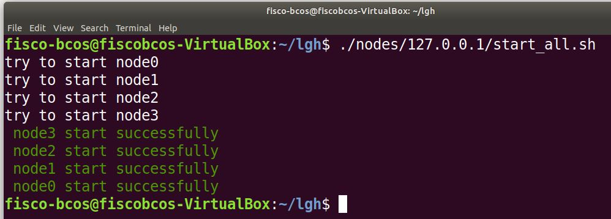
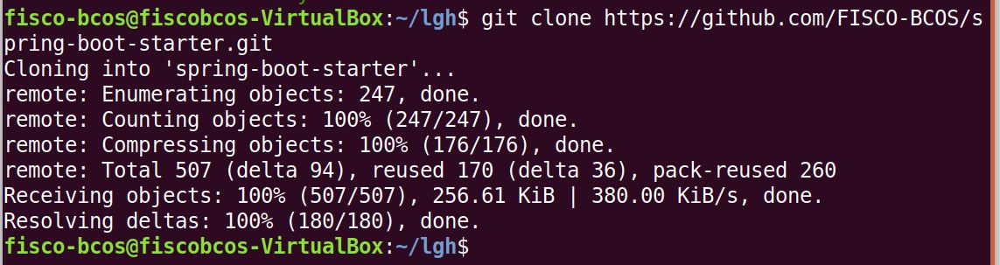
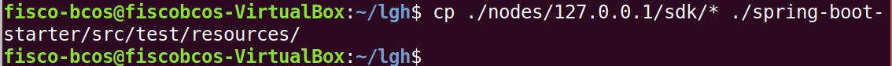
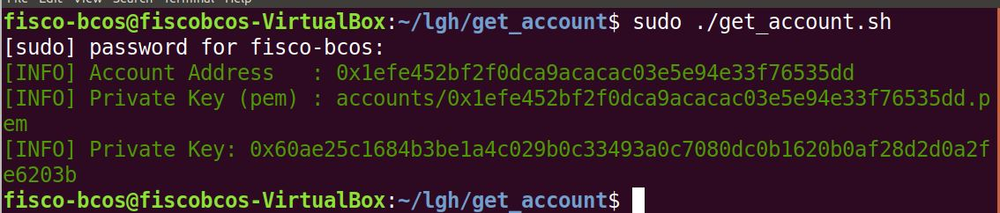
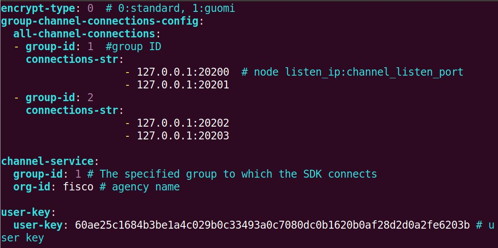
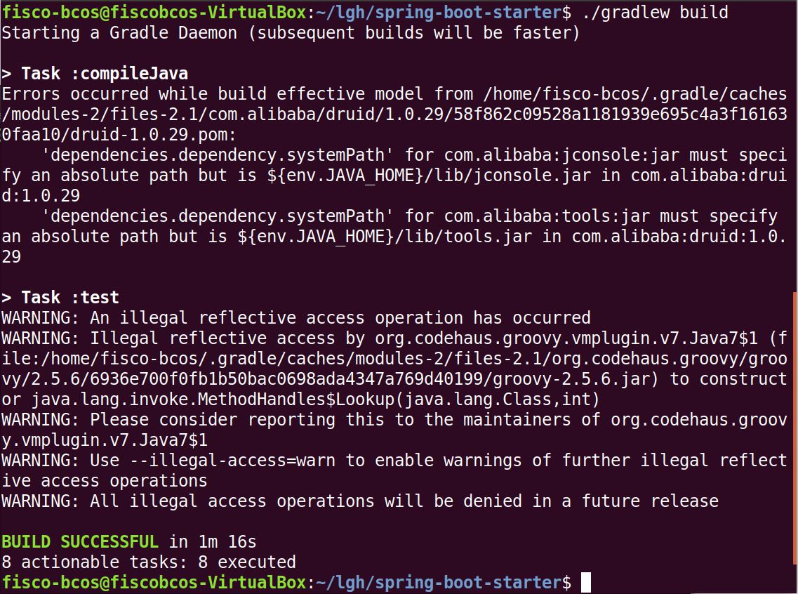
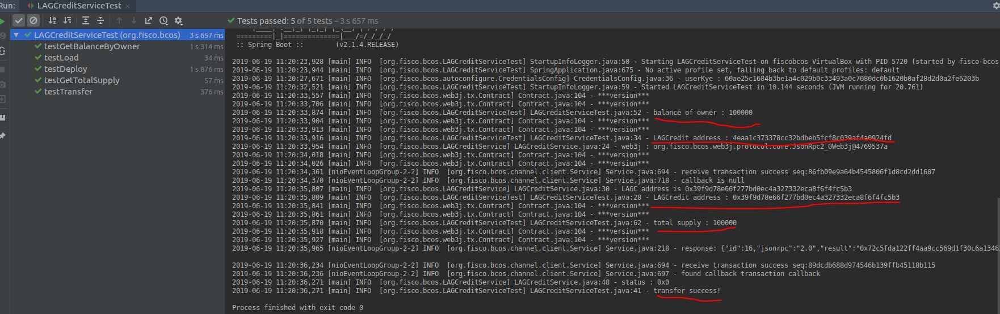

# Spring Boot Starter - 部署LAGC合约
## 启动节点   

## 获取源码   

## 复制节点证书文件   

## 生成私钥  

## 修改项目配置   

## 编译并运行测试案例    

## 编写智能合约
[LAGCredit.sol](./LAGCredit.sol)    
```solidity
pragma solidity ^0.4.25;
//积分系统
//功能：
//1、初始化积分
//2、总积分查询
//3、积分转账
//4、积分查询
//5、积分转账明细记录
contract LAGCredit{
    string name = "LAGC";
    string symbol = "LAG";
    uint256 totalSupply;
    mapping (address => uint256) private balances;
    event transferEvent(address from, address to, uint256 value);

	//构造函数：
	//参数：
	//initialSupply: 初始积分
	//creditName：积分名称
	//creditSymbol：积分简称
	constructor(uint256 initialSupply, string creditName, string creditSymbol)public{
		//初始化积分
        totalSupply = initialSupply;
		//合约部署者拥有所有积分
        balances[msg.sender] = totalSupply;
        name = creditName;
        symbol = creditSymbol;
    }

	//总积分查询
    function getTotalSupply()public view returns (uint256){
        return totalSupply;
    }

	//积分转账
    function _transfer(address _from, address _to, uint _value)internal{
        require(_to!=0x0);
        require(balances[_from]>=_value);
        require(_value>=0);

        uint previousBalances = balances[_from] + balances[_to];
        balances[_from] -=_value;
        balances[_to] += _value;
        emit transferEvent(_from, _to, _value);
        assert(balances[_from] + balances[_to] == previousBalances);
    }

	//积分转账
    function transfer(address _to, uint256 _value)public{
        _transfer(msg.sender, _to, _value);
    }   

	//积分查询
    function balanceOf(address _owner)public view returns(uint256){
        return balances[_owner];
    }
}
```
## 将智能合约转化成Java类    
    
LAGCredit.java的内容如下:    
```java
package org.fisco.bcos.contract;

import io.reactivex.Flowable;
import java.math.BigInteger;
import java.util.ArrayList;
import java.util.Arrays;
import java.util.Collections;
import java.util.List;
import org.fisco.bcos.channel.client.TransactionSucCallback;
import org.fisco.bcos.web3j.abi.EventEncoder;
import org.fisco.bcos.web3j.abi.FunctionEncoder;
import org.fisco.bcos.web3j.abi.TypeReference;
import org.fisco.bcos.web3j.abi.datatypes.Address;
import org.fisco.bcos.web3j.abi.datatypes.Event;
import org.fisco.bcos.web3j.abi.datatypes.Function;
import org.fisco.bcos.web3j.abi.datatypes.Type;
import org.fisco.bcos.web3j.abi.datatypes.generated.Uint256;
import org.fisco.bcos.web3j.crypto.Credentials;
import org.fisco.bcos.web3j.protocol.Web3j;
import org.fisco.bcos.web3j.protocol.core.DefaultBlockParameter;
import org.fisco.bcos.web3j.protocol.core.RemoteCall;
import org.fisco.bcos.web3j.protocol.core.methods.request.BcosFilter;
import org.fisco.bcos.web3j.protocol.core.methods.response.Log;
import org.fisco.bcos.web3j.protocol.core.methods.response.TransactionReceipt;
import org.fisco.bcos.web3j.tx.Contract;
import org.fisco.bcos.web3j.tx.TransactionManager;
import org.fisco.bcos.web3j.tx.gas.ContractGasProvider;

/**
 * <p>Auto generated code.
 * <p><strong>Do not modify!</strong>
 * <p>Please use the <a href="https://docs.web3j.io/command_line.html">web3j command line tools</a>,
 * or the org.fisco.bcos.web3j.codegen.SolidityFunctionWrapperGenerator in the
 * <a href="https://github.com/web3j/web3j/tree/master/codegen">codegen module</a> to update.
 *
 * <p>Generated with web3j version none.
 */
@SuppressWarnings("unchecked")
public class LAGCredit extends Contract {
    private static final String BINARY = "60806040526040805190810160405280600481526020017f4c414743000000000000000000000000000000000000000000000000000000008152506000908051906020019061004f929190610162565b506040805190810160405280600381526020017f4c414700000000000000000000000000000000000000000000000000000000008152506001908051906020019061009b929190610162565b503480156100a857600080fd5b506040516106a13803806106a183398101806040528101908080519060200190929190805182019291906020018051820192919050505082600281905550600254600360003373ffffffffffffffffffffffffffffffffffffffff1673ffffffffffffffffffffffffffffffffffffffff168152602001908152602001600020819055508160009080519060200190610142929190610162565b508060019080519060200190610159929190610162565b50505050610207565b828054600181600116156101000203166002900490600052602060002090601f016020900481019282601f106101a357805160ff19168380011785556101d1565b828001600101855582156101d1579182015b828111156101d05782518255916020019190600101906101b5565b5b5090506101de91906101e2565b5090565b61020491905b808211156102005760008160009055506001016101e8565b5090565b90565b61048b806102166000396000f300608060405260043610610057576000357c0100000000000000000000000000000000000000000000000000000000900463ffffffff16806370a082311461005c578063a9059cbb146100b3578063c4e41b2214610100575b600080fd5b34801561006857600080fd5b5061009d600480360381019080803573ffffffffffffffffffffffffffffffffffffffff16906020019092919050505061012b565b6040518082815260200191505060405180910390f35b3480156100bf57600080fd5b506100fe600480360381019080803573ffffffffffffffffffffffffffffffffffffffff16906020019092919080359060200190929190505050610174565b005b34801561010c57600080fd5b50610115610183565b6040518082815260200191505060405180910390f35b6000600360008373ffffffffffffffffffffffffffffffffffffffff1673ffffffffffffffffffffffffffffffffffffffff168152602001908152602001600020549050919050565b61017f33838361018d565b5050565b6000600254905090565b6000808373ffffffffffffffffffffffffffffffffffffffff16141515156101b457600080fd5b81600360008673ffffffffffffffffffffffffffffffffffffffff1673ffffffffffffffffffffffffffffffffffffffff168152602001908152602001600020541015151561020257600080fd5b6000821015151561021257600080fd5b600360008473ffffffffffffffffffffffffffffffffffffffff1673ffffffffffffffffffffffffffffffffffffffff16815260200190815260200160002054600360008673ffffffffffffffffffffffffffffffffffffffff1673ffffffffffffffffffffffffffffffffffffffff1681526020019081526020016000205401905081600360008673ffffffffffffffffffffffffffffffffffffffff1673ffffffffffffffffffffffffffffffffffffffff1681526020019081526020016000206000828254039250508190555081600360008573ffffffffffffffffffffffffffffffffffffffff1673ffffffffffffffffffffffffffffffffffffffff168152602001908152602001600020600082825401925050819055507f5d439cf3a1f6215b41908e5b0b300f39679a3ff1cc010691c1d4ec4d0e2a4ebb848484604051808473ffffffffffffffffffffffffffffffffffffffff1673ffffffffffffffffffffffffffffffffffffffff1681526020018373ffffffffffffffffffffffffffffffffffffffff1673ffffffffffffffffffffffffffffffffffffffff168152602001828152602001935050505060405180910390a180600360008573ffffffffffffffffffffffffffffffffffffffff1673ffffffffffffffffffffffffffffffffffffffff16815260200190815260200160002054600360008773ffffffffffffffffffffffffffffffffffffffff1673ffffffffffffffffffffffffffffffffffffffff168152602001908152602001600020540114151561045957fe5b505050505600a165627a7a72305820dab947b8e623d33a86e64916ecdfc20b2408f4cc73c63a631493df6295e28f980029";

    public static final String FUNC_BALANCEOF = "balanceOf";

    public static final String FUNC_TRANSFER = "transfer";

    public static final String FUNC_GETTOTALSUPPLY = "getTotalSupply";

    public static final Event TRANSFEREVENT_EVENT = new Event("transferEvent",
            Arrays.<TypeReference<?>>asList(new TypeReference<Address>() {}, new TypeReference<Address>() {}, new TypeReference<Uint256>() {}));
    ;

    @Deprecated
    protected LAGCredit(String contractAddress, Web3j web3j, Credentials credentials, BigInteger gasPrice, BigInteger gasLimit) {
        super(BINARY, contractAddress, web3j, credentials, gasPrice, gasLimit);
    }

    protected LAGCredit(String contractAddress, Web3j web3j, Credentials credentials, ContractGasProvider contractGasProvider) {
        super(BINARY, contractAddress, web3j, credentials, contractGasProvider);
    }

    @Deprecated
    protected LAGCredit(String contractAddress, Web3j web3j, TransactionManager transactionManager, BigInteger gasPrice, BigInteger gasLimit) {
        super(BINARY, contractAddress, web3j, transactionManager, gasPrice, gasLimit);
    }

    protected LAGCredit(String contractAddress, Web3j web3j, TransactionManager transactionManager, ContractGasProvider contractGasProvider) {
        super(BINARY, contractAddress, web3j, transactionManager, contractGasProvider);
    }

    public RemoteCall<BigInteger> balanceOf(String _owner) {
        final Function function = new Function(FUNC_BALANCEOF,
                Arrays.<Type>asList(new org.fisco.bcos.web3j.abi.datatypes.Address(_owner)),
                Arrays.<TypeReference<?>>asList(new TypeReference<Uint256>() {}));
        return executeRemoteCallSingleValueReturn(function, BigInteger.class);
    }

    public RemoteCall<TransactionReceipt> transfer(String _to, BigInteger _value) {
        final Function function = new Function(
                FUNC_TRANSFER,
                Arrays.<Type>asList(new org.fisco.bcos.web3j.abi.datatypes.Address(_to),
                new org.fisco.bcos.web3j.abi.datatypes.generated.Uint256(_value)),
                Collections.<TypeReference<?>>emptyList());
        return executeRemoteCallTransaction(function);
    }

    public void transfer(String _to, BigInteger _value, TransactionSucCallback callback) {
        final Function function = new Function(
                FUNC_TRANSFER,
                Arrays.<Type>asList(new org.fisco.bcos.web3j.abi.datatypes.Address(_to),
                new org.fisco.bcos.web3j.abi.datatypes.generated.Uint256(_value)),
                Collections.<TypeReference<?>>emptyList());
        asyncExecuteTransaction(function, callback);
    }

    public RemoteCall<BigInteger> getTotalSupply() {
        final Function function = new Function(FUNC_GETTOTALSUPPLY,
                Arrays.<Type>asList(),
                Arrays.<TypeReference<?>>asList(new TypeReference<Uint256>() {}));
        return executeRemoteCallSingleValueReturn(function, BigInteger.class);
    }

    public List<TransferEventEventResponse> getTransferEventEvents(TransactionReceipt transactionReceipt) {
        List<Contract.EventValuesWithLog> valueList = extractEventParametersWithLog(TRANSFEREVENT_EVENT, transactionReceipt);
        ArrayList<TransferEventEventResponse> responses = new ArrayList<TransferEventEventResponse>(valueList.size());
        for (Contract.EventValuesWithLog eventValues : valueList) {
            TransferEventEventResponse typedResponse = new TransferEventEventResponse();
            typedResponse.log = eventValues.getLog();
            typedResponse.from = (String) eventValues.getNonIndexedValues().get(0).getValue();
            typedResponse.to = (String) eventValues.getNonIndexedValues().get(1).getValue();
            typedResponse.value = (BigInteger) eventValues.getNonIndexedValues().get(2).getValue();
            responses.add(typedResponse);
        }
        return responses;
    }

    public Flowable<TransferEventEventResponse> transferEventEventFlowable(BcosFilter filter) {
        return web3j.logFlowable(filter).map(new io.reactivex.functions.Function<Log, TransferEventEventResponse>() {
            @Override
            public TransferEventEventResponse apply(Log log) {
                Contract.EventValuesWithLog eventValues = extractEventParametersWithLog(TRANSFEREVENT_EVENT, log);
                TransferEventEventResponse typedResponse = new TransferEventEventResponse();
                typedResponse.log = log;
                typedResponse.from = (String) eventValues.getNonIndexedValues().get(0).getValue();
                typedResponse.to = (String) eventValues.getNonIndexedValues().get(1).getValue();
                typedResponse.value = (BigInteger) eventValues.getNonIndexedValues().get(2).getValue();
                return typedResponse;
            }
        });
    }

    public Flowable<TransferEventEventResponse> transferEventEventFlowable(DefaultBlockParameter startBlock, DefaultBlockParameter endBlock) {
        BcosFilter filter = new BcosFilter(startBlock, endBlock, getContractAddress());
        filter.addSingleTopic(EventEncoder.encode(TRANSFEREVENT_EVENT));
        return transferEventEventFlowable(filter);
    }

    @Deprecated
    public static LAGCredit load(String contractAddress, Web3j web3j, Credentials credentials, BigInteger gasPrice, BigInteger gasLimit) {
        return new LAGCredit(contractAddress, web3j, credentials, gasPrice, gasLimit);
    }

    @Deprecated
    public static LAGCredit load(String contractAddress, Web3j web3j, TransactionManager transactionManager, BigInteger gasPrice, BigInteger gasLimit) {
        return new LAGCredit(contractAddress, web3j, transactionManager, gasPrice, gasLimit);
    }

    public static LAGCredit load(String contractAddress, Web3j web3j, Credentials credentials, ContractGasProvider contractGasProvider) {
        return new LAGCredit(contractAddress, web3j, credentials, contractGasProvider);
    }

    public static LAGCredit load(String contractAddress, Web3j web3j, TransactionManager transactionManager, ContractGasProvider contractGasProvider) {
        return new LAGCredit(contractAddress, web3j, transactionManager, contractGasProvider);
    }

    public static RemoteCall<LAGCredit> deploy(Web3j web3j, Credentials credentials, ContractGasProvider contractGasProvider, BigInteger initialSupply, String creditName, String creditSymbol) {
        String encodedConstructor = FunctionEncoder.encodeConstructor(Arrays.<Type>asList(new org.fisco.bcos.web3j.abi.datatypes.generated.Uint256(initialSupply),
                new org.fisco.bcos.web3j.abi.datatypes.Utf8String(creditName),
                new org.fisco.bcos.web3j.abi.datatypes.Utf8String(creditSymbol)));
        return deployRemoteCall(LAGCredit.class, web3j, credentials, contractGasProvider, BINARY, encodedConstructor);
    }

    public static RemoteCall<LAGCredit> deploy(Web3j web3j, TransactionManager transactionManager, ContractGasProvider contractGasProvider, BigInteger initialSupply, String creditName, String creditSymbol) {
        String encodedConstructor = FunctionEncoder.encodeConstructor(Arrays.<Type>asList(new org.fisco.bcos.web3j.abi.datatypes.generated.Uint256(initialSupply),
                new org.fisco.bcos.web3j.abi.datatypes.Utf8String(creditName),
                new org.fisco.bcos.web3j.abi.datatypes.Utf8String(creditSymbol)));
        return deployRemoteCall(LAGCredit.class, web3j, transactionManager, contractGasProvider, BINARY, encodedConstructor);
    }

    @Deprecated
    public static RemoteCall<LAGCredit> deploy(Web3j web3j, Credentials credentials, BigInteger gasPrice, BigInteger gasLimit, BigInteger initialSupply, String creditName, String creditSymbol) {
        String encodedConstructor = FunctionEncoder.encodeConstructor(Arrays.<Type>asList(new org.fisco.bcos.web3j.abi.datatypes.generated.Uint256(initialSupply),
                new org.fisco.bcos.web3j.abi.datatypes.Utf8String(creditName),
                new org.fisco.bcos.web3j.abi.datatypes.Utf8String(creditSymbol)));
        return deployRemoteCall(LAGCredit.class, web3j, credentials, gasPrice, gasLimit, BINARY, encodedConstructor);
    }

    @Deprecated
    public static RemoteCall<LAGCredit> deploy(Web3j web3j, TransactionManager transactionManager, BigInteger gasPrice, BigInteger gasLimit, BigInteger initialSupply, String creditName, String creditSymbol) {
        String encodedConstructor = FunctionEncoder.encodeConstructor(Arrays.<Type>asList(new org.fisco.bcos.web3j.abi.datatypes.generated.Uint256(initialSupply),
                new org.fisco.bcos.web3j.abi.datatypes.Utf8String(creditName),
                new org.fisco.bcos.web3j.abi.datatypes.Utf8String(creditSymbol)));
        return deployRemoteCall(LAGCredit.class, web3j, transactionManager, gasPrice, gasLimit, BINARY, encodedConstructor);
    }

    public static class TransferEventEventResponse {
        public Log log;

        public String from;

        public String to;

        public BigInteger value;
    }
}
```
## 编写服务   
```java
package org.fisco.bcos;

import lombok.extern.slf4j.Slf4j;
import org.fisco.bcos.constants.GasConstants;
import org.fisco.bcos.contract.LAGCredit;
import org.fisco.bcos.web3j.crypto.Credentials;
import org.fisco.bcos.web3j.protocol.Web3j;
import org.fisco.bcos.web3j.protocol.core.methods.response.TransactionReceipt;
import org.fisco.bcos.web3j.tx.gas.StaticGasProvider;
import org.springframework.beans.factory.annotation.Autowired;
import org.springframework.stereotype.Component;

import java.math.BigInteger;

@Slf4j
public class LAGCreditService {
    Web3j web3j;
    Credentials credentials;
    public LAGCreditService(Web3j web3j, Credentials credentials){
        this.web3j = web3j;
        this.credentials = credentials;
    }
    public LAGCredit deploy(){
        log.info("web3j : {}", web3j);
        LAGCredit lagCredit = null;
        try{
            lagCredit = LAGCredit.deploy(web3j, credentials,
                    new StaticGasProvider(GasConstants.GAS_PRICE,GasConstants.GAS_LIMIT),
                    new BigInteger("100000"), "LAGCredit", "LAG").send();
            log.info("LAGC address is {}", lagCredit.getContractAddress());
            return lagCredit;
        }catch (Exception e){
            log.error("deploy lacg contract fail: {}", e.getMessage());
        }
        return lagCredit;
    }

    public LAGCredit load(String creditAddress){
        LAGCredit lagCredit = LAGCredit.load(creditAddress, web3j, credentials,
                new StaticGasProvider(GasConstants.GAS_PRICE, GasConstants.GAS_LIMIT));
        return lagCredit;
    }

    public boolean transfer(String creditAddress, String to, BigInteger value){
        try{
            LAGCredit lagCredit = load(creditAddress);
            TransactionReceipt receipt = lagCredit.transfer(to, value).send();
            log.info("status : {}", receipt.getStatus());
        }catch(Exception e){
            e.printStackTrace();
        }
        return true;
    }

    public long getBalanceByOwner(String creditAddress, String owner)throws Exception{
        LAGCredit lagCredit = load(creditAddress);
        BigInteger balance = lagCredit.balanceOf(owner).send();
        return balance.longValue();
    }

    public long getTotalSupply(String creditAddress) throws Exception{
        LAGCredit lagCredit = load(creditAddress);
        BigInteger total = lagCredit.getTotalSupply().send();
        return total.longValue();
    }
}
```   
## 增加服务配置   
```java
package org.fisco.bcos.autoconfigure;

import lombok.extern.slf4j.Slf4j;
import org.fisco.bcos.LAGCreditService;
import org.fisco.bcos.web3j.crypto.Credentials;
import org.fisco.bcos.web3j.protocol.Web3j;
import org.springframework.context.annotation.Bean;
import org.springframework.context.annotation.Configuration;

@Configuration
@Slf4j
public class LAGCreditServiceConfig {
    @Bean
    public LAGCreditService getLAGCreditService(Web3j web3j, Credentials credentials){
        return new LAGCreditService(web3j, credentials);
    }
}
```

## 编写测试    
```java
package org.fisco.bcos;

import lombok.extern.slf4j.Slf4j;
import org.fisco.bcos.contract.LAGCredit;
import org.fisco.bcos.web3j.crypto.Credentials;
import org.fisco.bcos.web3j.protocol.Web3j;
import org.junit.BeforeClass;
import org.junit.Test;
import org.springframework.beans.factory.annotation.Autowired;

import java.math.BigInteger;

@Slf4j
public class LAGCreditServiceTest extends BaseTest{
    @Autowired
    Web3j web3j;
    @Autowired
    Credentials credentials;
    @Autowired
    LAGCreditService lagCreditService;
    String creditAddr = "4eaa1c373378cc32bdbeb5fcf8c039af4a0924fd";
    String ownerAddr = "1efe452bf2f0dca9acacac03e5e94e33f76535dd";
    String toAddr = "9cea183631c358a04dd519abb90c7a45ed371612";

    @Test
    public void testDeploy(){
        LAGCredit lagCredit = lagCreditService.deploy();
        log.info("LAGCredit address : {}", lagCredit.getContractAddress());
    }

    @Test
    public void testLoad(){
        LAGCredit lagCredit = lagCreditService.load(creditAddr);
        log.info("LAGCredit address : {}", lagCredit.getContractAddress());
    }

    @Test
    public void testTransfer(){
        boolean flag = lagCreditService.transfer(creditAddr, toAddr, new BigInteger("1000"));
        if(flag){
            log.info("transfer success!");
        }
        else{
            log.info("transfer failed!");
        }
    }

    @Test
    public void testGetBalanceByOwner(){
        try {
            long balance = lagCreditService.getBalanceByOwner(creditAddr, ownerAddr);
            log.info("balance of owner : {}", balance);
        } catch (Exception e) {
            e.printStackTrace();
        }
    }

    @Test
    public void testGetTotalSupply(){
        try {
            long totalSupply = lagCreditService.getTotalSupply(creditAddr);
            log.info("total supply : {}", totalSupply);
        } catch (Exception e) {
            e.printStackTrace();
        }
    }
}

```
## 测试结果   

