# day2  作业报告 -- 石望华

------

## 1. 作业内容

1. 用僵尸游戏熟悉solidity规则 https://cryptozombies.io/en/lesson
2. 课堂实验
3. 使用spring-boot-starter部署课上的LAG积分合约https://github.com/FISCO-BCOS/spring-boot-starter/blob/master/doc/README_CN.md

## 2. 

# 3. remix - 测试

### 3.1 查询

* 设有不同的四个地址a,b,c,d（对应remix中的四个Account）

* 用a Deploy shop合约，设置构造函数的参数（积分为十万），点击transact，得到一个shop1，地址在memory中的b，其所有者（owner）是a，其积分总数是调用构造函数时传入的参数

* 用a再次部署一次shop 合约（积分为二十万），得到一个地址在内存中的c的shop2，**其owner还是a**

* 调用balanceOf函数，发现在shop1中调用balanceOf函数，传入a地址，得到十万，而在shop2中传入a地址，**得到二十万**！说明两个shop下的两个映射是不同的，同一个地址下映射到两个积分值；另外，在两个shop的balanceOf里都传入b、c时，得到的四个值**都是0**！

* 以上测试截图记录如下：

  

### 3.2 转账

* 在shop1调用transfer函数，从a转20000到b，得到a的balance是8万，b的balance是2万，记录如下：

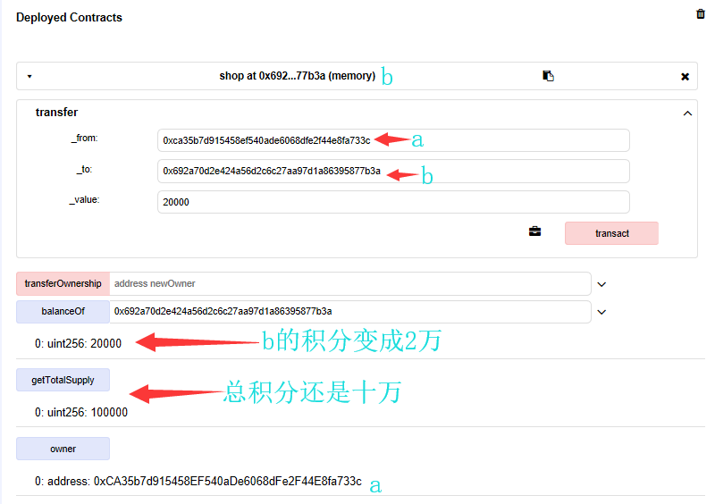

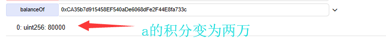

* 在shop2内从a转40000到c，得到a的积分为16万，c的积分为4万；再在shop2内从c转5000到地址b，得到c剩下35000，而b是5000，这里的b是**shop2内的b**！与shop1内地址b是不同的！这里不再截图。

### 3.3 当前结论

* 用地址a Deploy 一个shop合约后（即transact，调用一次构造函数），得到一个shop和一个用户地址b
* 在这个shop内部记录了a的balance和内部所有其他地址（不需要显示的声明！）的balance，店主a和消费者b一样，都看成一种账户类型，只是a的初始balance值不为0，b的balance值为0
* 每次调用一次构造函数得到一个不同的shop，如果用同一个地址a调用的构造函数，则表示a有两个shops，每个shop内各自记录a在这个shop里的balance

### 3.4 转换shop所有权

* 调用transferOwnership出现错误：

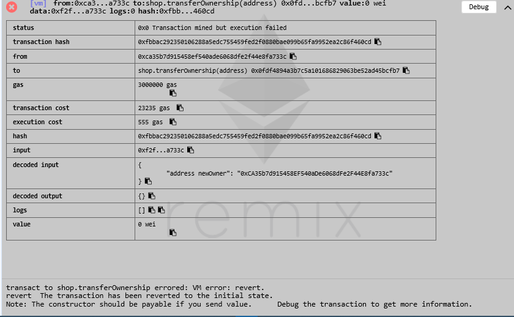

# 4. Spring-Boot 部署

* build 成功（如果是从windows下拷贝过来的，要把window文本换行格式转成unix的换行格式）

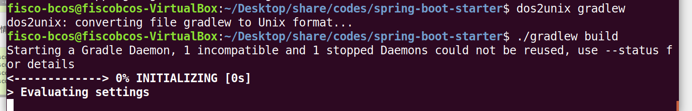

* 在windows IDEA中运行spring-boot项目时遇到问题：

  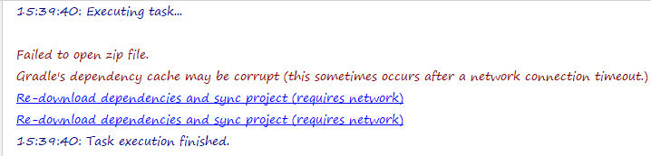

* 在ubuntu terminal中调用脚本sol转java时遇到问题：

  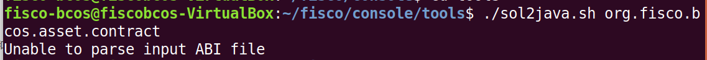

  发现我的控制台console的文件结构与官方文档的不同，没有console/contracts/solidity这个目录

* Spring项目AssetApp和SpringBoot项目Shop的主要区别：

  * Spring中没有sol**合约转java文件**的java代码，是通过调用sol2java脚本进行编译生成java的，SpringBoot有个SolidityFunctionWrapperGeneratorTest.java实现了同样的功能
  * Spring中对合约编译成的Asset.java类的功能、函数进行调用、封装的是Asset**Client**.java类，SpringBoot中调用Shop.java(即LAGCredit.java)类的是LAGCredit**Service**.java类，但我还是沿用的ShopClient.java这个名称
  * Spring中的**日志记录**是用的org.slf4j.Logger和LoggerFactory，SpringBoot的日志记录用的是import lombok.extern.slf4j.Slf4j
  * SpringBoot中用到的注解明显多些，有@Slf4j（日志）、@Data、@Configuration（配置）、@ConfigurationProperties（加载yml中的配置）、@Bean、@SuppressWarnings、@EnableConfigurationProperties、@SpringBootApplication、@Autowired、@Test、@Ignore、@Override、@Deprecated，通过这些注解可以读取配置文件、获取Web3j对象等，而Spring项目中是在AssetClient.java的initialize函数里完成这些操作的。

* 解决格式问题  **./gradlew goJF**

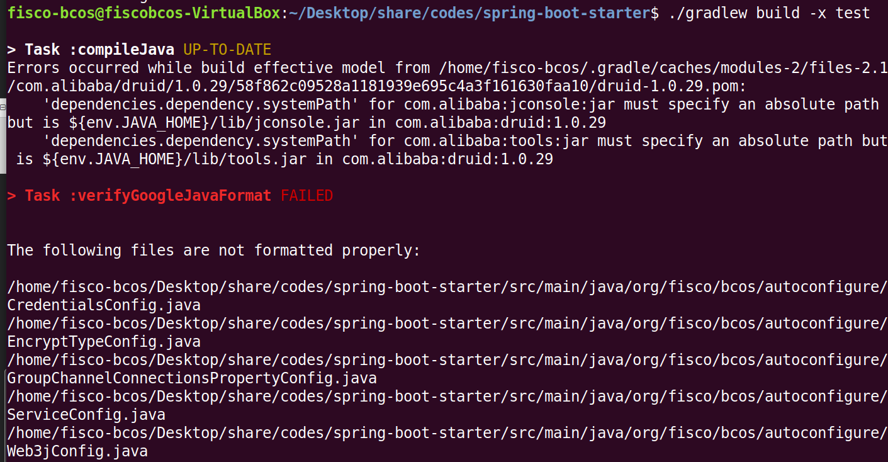

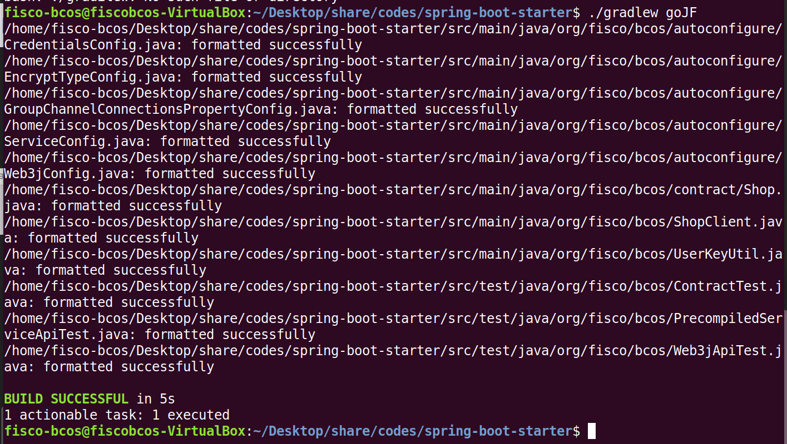

* 一次失败的测试报告（**6.21下午**）：

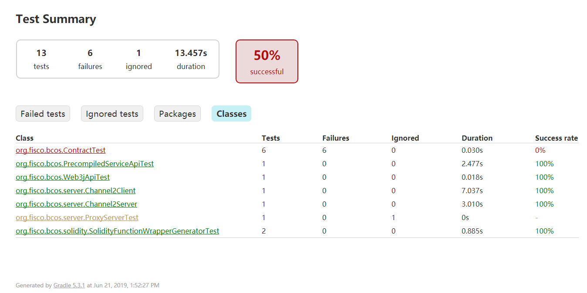

对合约功能的测试全部失败，但其他的测试全部通过，虚拟机的终端里的错误是这样的：

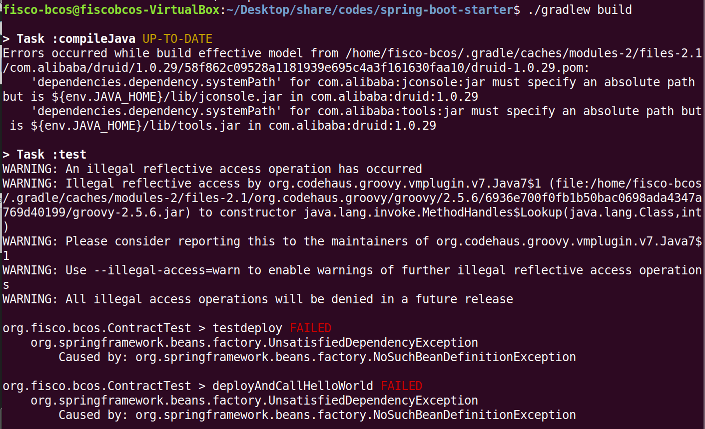

如果不执行test的话，可以build成功，但还有这些错误：

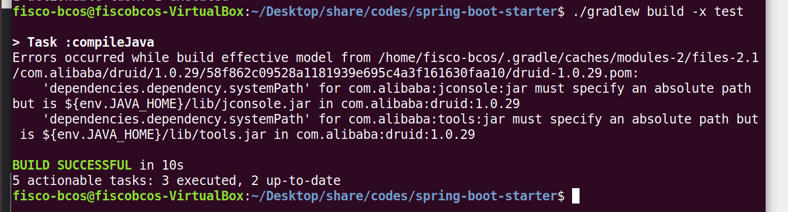

* 问了同学，解决了一个大bug，没加对ShopClient的配置文件，我之前一直好奇为什么ShopClient里有个构造函数、但找不到调用它的地方，原来是在配置文件里，配置文件里都是get函数，返回相应的对象。最后，build的结果是这样的了：（6月21日）

  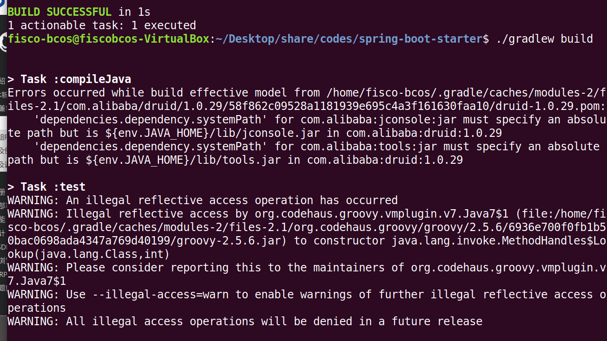

  现在的测试报告显示**100%通过**了，但从上面的命令行可以看到没有输出

  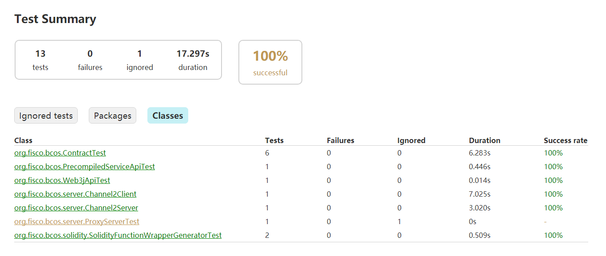

* 群里有同学说是要换个JDK，换成1.8.0版本的，然后build失败了：

  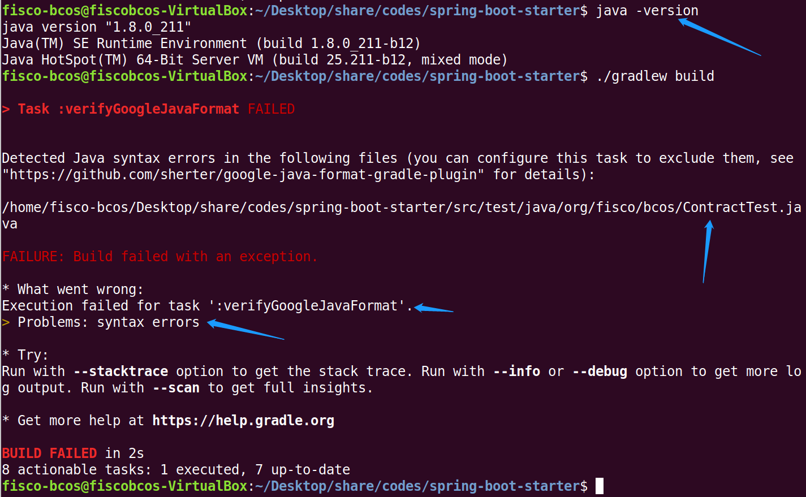

显示是有个文件有语法错误，但之前是可以编译成功的；上面还显示verifyGoogleJavaFormat FAILED，于是运行./gradlew goJF，也是说有语法错误：

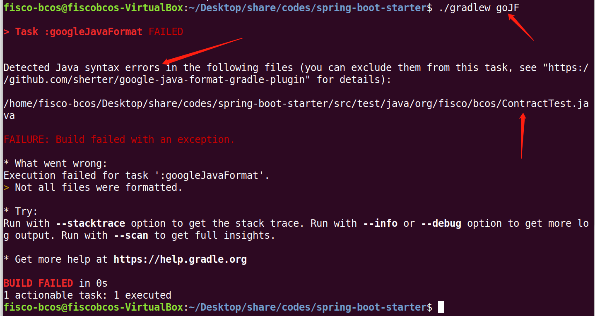

我特意在ContractTest.java里写了个错误，然后build，是会报出是哪一行出错、出什么错误的，但上面两个图片中都没有指明是什么错误。

无论如何，现在的测试报告还是显示100%通过的，尽管build失败了。

* 6月24日下午，为了把上午新出的所谓的“语法错误”揪出来，我一行一行把ContractTest.java的代码注释掉，在虚拟机里运行./gradlew goJF进行格式转化测试，最后发现是import包部分的代码的问题——import部分不能插入有“//”注释！（虽然上周这么做似乎没有出现bug）此外，还发现google的这个goJF命令还会改变import包的顺序，甚至可能删除你的代码！（当那个import包没有用到时）

  最后，我分别在java11和java8的环境下运行./gradlew build, 得到以下结果：

  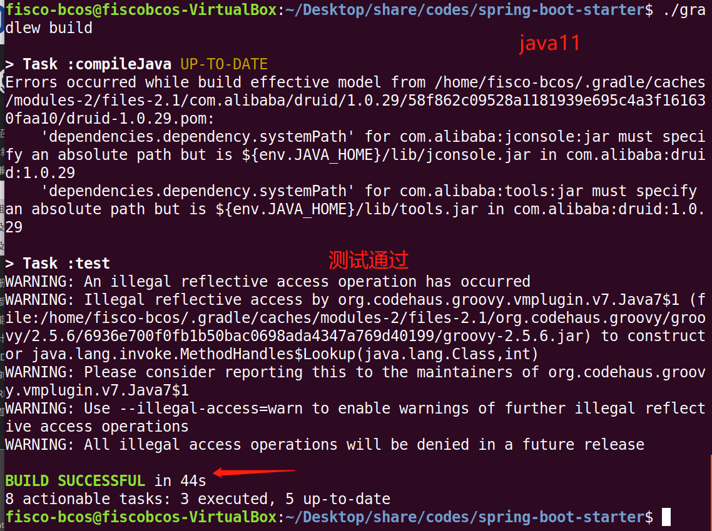

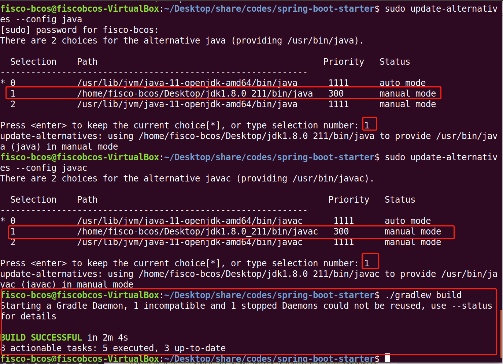

​	似乎除了输出更少了，没什么其他区别......

