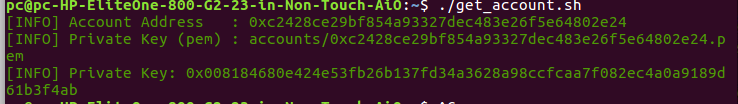
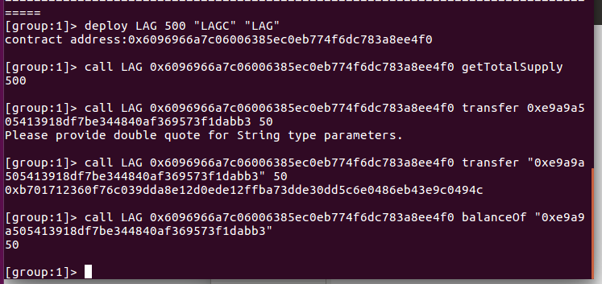
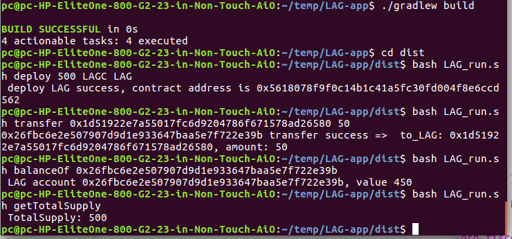

# 第二次作业——部署LAGC积分系统合约

##### 这次我使用了三种方式来部署LAGC积分系统合约

+ ##### FISCO-BCOS控制台部署（./LAG.sol)

+ ##### spring-boot-starter部署   (./spring-boot-starter/)

+ ##### 仿照案例[Asset-app](https://fisco-bcos-documentation.readthedocs.io/zh_CN/latest/docs/tutorial/sdk_application.html)部署  (./LAG-app/)

## FISCO-BCOS控制台部署

### 1. 编写合约(LAG.sol)

```
pragma solidity ^0.4.24;

contract LAG{
    string name="LAGC";
    string symbol="LAG";
    uint256 totalSupply;
    
    mapping(address=>uint256) private balances;
    event transferEvent(address from, address to, uint256 value);
    
    constructor(uint256 initialSupply, string CreditName, string CreditSymbol) public{
        totalSupply=initialSupply;
        balances[msg.sender]=totalSupply;
        name=CreditName;
        symbol=CreditSymbol;
    }
    function getTotalSupply() constant public returns (uint256){
        return totalSupply;
    }
    function _transfer(address _from, address _to, uint256 _value) internal{
        require(_to!=0x0);
        require(balances[_from]>=_value);
        require(balances[_from]+_value>=balances[_from]);
        uint previousBalances=balances[_from]+balances[_to];
        
        balances[_from]-=_value;
        balances[_to]+=_value;
        
        emit transferEvent(_from,_to,_value);
        assert(balances[_from]+balances[_to]==previousBalances);
    }
    function transfer(address _to, uint256 _value) public {
		_transfer(msg.sender, _to, _value);
	}
    function balanceOf(address _owner) constant public returns (uint256){
        return balances[_owner];
    }
}

```

### 2. 启动FISCO-BCOS链

##### 执行命令

```
bash nodes/127.0.0.1/start_all.sh
```

##### 

### 3. 启动控制台

``` 
cd ~/fisco/console
./start.sh
```

### 4. 获取账户地址

##### 

### 5. 部署合约

##### 

## spring-boot-starter部署

### 1. 下载

``` 
git clone https://github.com/FISCO-BCOS/spring-boot-starter.git
```

### 2. 拷贝区块链节点对应的SDK证书

``` 
cp fisco/nodes/127.0.0.1/sdk/* asset-app/src/test/resources/
```

### 3. 修改application.yml配置

``` 
encrypt-type: 0  # 0:standard, 1:guomi
group-channel-connections-config:
  all-channel-connections:
  - group-id: 1  #group ID
    connections-str:
                    - 127.0.0.1:20200  # node listen_ip:channel_listen_port
                    - 127.0.0.1:20201
  - groupId: 2
    connections-str:
                    - 127.0.0.1:20202
                    - 127.0.0.1:20203
channel-service:
  group-id: 1 # The specified group to which the SDK connects
  org-id: fisco # agency name

user-key:
  user-key: 3bed914595c159cbce70ec5fb6aff3d6797e0c5ee5a7a9224a21cae8932d84a4 # user key 
```

### 4. 编写智能合约

##### 和FISCO-BCOS控制台部署的智能合约相同

### 5. 合约编译

``` 
cd ~/fisco/console/
./sol2java.sh org.fisco.bcos.asset.contract
```

### 6. 编写服务

``` 
package org.fisco.bcos;

import lombok.extern.slf4j.Slf4j;
import org.fisco.bcos.constants.GasConstants;
import org.fisco.bcos.contract.LAG;
import org.fisco.bcos.web3j.crypto.Credentials;
import org.fisco.bcos.web3j.protocol.Web3j;
import org.fisco.bcos.web3j.protocol.core.methods.response.TransactionReceipt;
import org.fisco.bcos.web3j.tx.gas.StaticGasProvider;


import java.math.BigInteger;

@Slf4j
public class LAGService {
    Web3j web3j;
    Credentials credentials;
    public LAGService(Web3j web3j, Credentials credentials){
        this.web3j = web3j;
        this.credentials = credentials;
    }
    public LAG deploy(){
        log.info("web3j : {}", web3j);
        LAG lag = null;
        try{
            lag = LAG.deploy(web3j, credentials,
                    new StaticGasProvider(GasConstants.GAS_PRICE,GasConstants.GAS_LIMIT),
                    new BigInteger("100000"), "LAGC", "LAG").send();
            log.info("LAGC address is {}", lag.getContractAddress());
            return lag;
        }catch (Exception e){
            log.error("deploy lacg contract fail: {}", e.getMessage());
        }
        return lag;
    }

    public LAG load(String creditAddress){
        LAG lag = LAG.load(creditAddress, web3j, credentials,
                new StaticGasProvider(GasConstants.GAS_PRICE, GasConstants.GAS_LIMIT));
        return lag;
    }

    public boolean transfer(String creditAddress, String to, BigInteger value){
        try{
            LAG lag = load(creditAddress);
            TransactionReceipt receipt = lag.transfer(to, value).send();
            log.info("status : {}", receipt.getStatus());
        }catch(Exception e){
            e.printStackTrace();
        }
        return true;
    }

    public long getBalanceByOwner(String creditAddress, String owner)throws Exception{
        LAG lag = load(creditAddress);
        BigInteger balance = lag.balanceOf(owner).send();
        return balance.longValue();
    }

    public long getTotalSupply(String creditAddress) throws Exception{
        LAG lag = load(creditAddress);
        BigInteger total = lag.getTotalSupply().send();
        return total.longValue();
    }
}
```

### 7. 编写测试

``` 
package org.fisco.bcos;
import lombok.extern.slf4j.Slf4j;
import org.fisco.bcos.contract.LAG;
import org.fisco.bcos.web3j.crypto.Credentials;
import org.fisco.bcos.web3j.protocol.Web3j;
import org.junit.Test;
import org.springframework.beans.factory.annotation.Autowired;

import java.math.BigInteger;

@Slf4j
public class LAGServiceTest extends BaseTest{
    @Autowired
    Web3j web3j;
    @Autowired
    Credentials credentials;
    @Autowired
    LAGService lagService;
    String creditAddr = "0xb7332cc0e30024551d9620a1b7e7cae5a23de1d4";
    String ownerAddr = "94e949260187b1a6ea9be7c513aa5791a74c6975";
    String toAddr = "c2428ce29bf854a93327dec483e26f5e64802e24";

    @Test
    public void testDeploy(){
        LAG lag = lagService.deploy();
        log.info("LAG address : {}", lag.getContractAddress());
    }

    @Test
    public void testLoad(){
        LAG lag = lagService.load(creditAddr);
        log.info("LAG address : {}", lag.getContractAddress());
    }

    @Test
    public void testTransfer(){
        boolean flag = lagService.transfer(creditAddr, toAddr, new BigInteger("1000"));
        if(flag){
            log.info("transfer success!");
        }
        else{
            log.info("transfer failed!");
        }
    }

    @Test
    public void testGetBalanceByOwner(){
        try {
            long balance = lagService.getBalanceByOwner(creditAddr, ownerAddr);
            log.info("balance of owner : {}", balance);
        } catch (Exception e) {
            e.printStackTrace();
        }
    }

    @Test
    public void testGetTotalSupply(){
        try {
            long totalSupply = lagService.getTotalSupply(creditAddr);
            log.info("total supply : {}", totalSupply);
        } catch (Exception e) {
            e.printStackTrace();
        }
    }
}
```

### 8. 编译项目

``` 
./gradlew build
```

### 9. 运行测试

##### 测试截图


## 仿照案例Asset-app部署

### 1. 下载asset-app

``` 
curl -LO https://github.com/FISCO-BCOS/LargeFiles/raw/master/tools/asset-app.tar.gz
tar -zxf asset-app.tar.gz
```

### 2. 拷贝区块链节点对应的SDK证书

``` 
cp fisco/nodes/127.0.0.1/sdk/* asset-app/src/test/resources/
```

### 3. 修改./tool/Asset_run.sh

##### 因为这个脚本在项目编译成功之后会复制到./dist目录下并运行执行项目。我们的合约内容和asset-app项目不同，所以需要修改成我们自己的内容。并将文件名改为LAG_run.sh。

``` 
#!/bin/bash 

function usage() 
{
    echo " Usage : "
    echo "   bash LAG_run.sh deploy initialSupply CreditName CreditSymbol"
    echo "   bash LAG_run.sh getTotalSupply"
    echo "   bash LAG_run.sh balanceOf asset_account"
    echo "   bash LAG_run.sh transfer to_asset_account amount "
    echo " "
    echo " "
    echo "examples : "
    echo "   bash LAG_run.sh deploy 500 LAGC LAG"
    echo "   bash LAG_run.sh getTotalSupply"
    echo "   bash LAG_run.sh balanceOf asset_account "
    echo "   bash LAG_run.sh transfer  Asset1 11111 "
    exit 0
}

    case $1 in
    deploy)
            [ $# -lt 1 ] && { usage; }
            ;;
    getTotalSupply)
            [ $# -lt 1 ] && { usage; }
            ;;
    transfer)
            [ $# -lt 3 ] && { usage; }
            ;;
    balanceOf)
            [ $# -lt 2 ] && { usage; }
            ;;
    *)
        usage
            ;;
    esac

    java -cp 'apps/*:conf/:lib/*' org.fisco.bcos.LAGCredit.client.LAGClient $@
```

### 4. 替换文件

##### 将项目下的asset.*替换成我们自己编写的合约对应文件（比如asset.java替换成LAG.java)。

### 5. 业务开发

##### 文件位置./LAG-app/src/main/java/org/fisco/bcos/LAGCredit/client

##### 文件LAGClient.java

``` 
package org.fisco.bcos.LAGCredit.client;

import java.io.FileNotFoundException;
import java.io.FileOutputStream;
import java.io.IOException;
import java.math.BigInteger;
import java.util.List;
import java.util.Properties;

import org.slf4j.Logger;
import org.slf4j.LoggerFactory;
import org.fisco.bcos.LAGCredit.contract.LAGCredit;
import org.fisco.bcos.LAGCredit.contract.LAGCredit.TransferEventEventResponse;
import org.fisco.bcos.channel.client.Service;
import org.fisco.bcos.web3j.crypto.Credentials;
import org.fisco.bcos.web3j.crypto.Keys;
import org.fisco.bcos.web3j.protocol.Web3j;
import org.fisco.bcos.web3j.protocol.channel.ChannelEthereumService;
import org.fisco.bcos.web3j.protocol.core.methods.response.TransactionReceipt;
import org.fisco.bcos.web3j.tuples.generated.Tuple2;
import org.fisco.bcos.web3j.tx.gas.StaticGasProvider;
import org.springframework.context.ApplicationContext;
import org.springframework.context.support.ClassPathXmlApplicationContext;
import org.springframework.core.io.ClassPathResource;
import org.springframework.core.io.Resource;

import org.apache.commons.logging.Log;
import org.apache.commons.logging.LogFactory;

public class LAGClient {

	static Logger logger = LoggerFactory.getLogger(LAGClient.class);

	private Web3j web3j;

	private Credentials credentials;

	public Web3j getWeb3j() {
		return web3j;
	}

	public void setWeb3j(Web3j web3j) {
		this.web3j = web3j;
	}

	public Credentials getCredentials() {
		return credentials;
	}

	public void setCredentials(Credentials credentials) {
		this.credentials = credentials;
	}

	public void recordLAGAddr(String address) throws FileNotFoundException, IOException {
		Properties prop = new Properties();
		prop.setProperty("address", address);
		final Resource contractResource = new ClassPathResource("contract.properties");
		FileOutputStream fileOutputStream = new FileOutputStream(contractResource.getFile());
		prop.store(fileOutputStream, "contract address");
	}

	public String loadLAGAddr() throws Exception {
		// load LAG contact address from contract.properties
		Properties prop = new Properties();
		final Resource contractResource = new ClassPathResource("contract.properties");
		prop.load(contractResource.getInputStream());

		String contractAddress = prop.getProperty("address");
		if (contractAddress == null || contractAddress.trim().equals("")) {
			throw new Exception(" load LAG contract address failed, please deploy it first. ");
		}
		logger.info(" load LAG address from contract.properties, address is {}", contractAddress);
		return contractAddress;
	}

	public void initialize() throws Exception {

		// init the Service
		@SuppressWarnings("resource")
		ApplicationContext context = new ClassPathXmlApplicationContext("classpath:applicationContext.xml");
		Service service = context.getBean(Service.class);
		service.run();

		ChannelEthereumService channelEthereumService = new ChannelEthereumService();
		channelEthereumService.setChannelService(service);
		Web3j web3j = Web3j.build(channelEthereumService, 1);

		// init Credentials
		Credentials credentials = Credentials.create(Keys.createEcKeyPair());

		setCredentials(credentials);
		setWeb3j(web3j);

		logger.debug(" web3j is " + web3j + " ,credentials is " + credentials);
	}

	private static BigInteger gasPrice = new BigInteger("30000000");
	private static BigInteger gasLimit = new BigInteger("30000000");

	public void deployLAGAndRecordAddr(BigInteger initialSupply, String CreditName, String CreditSymbol) {
		try {
			 LAGCredit lagCredit = LAGCredit.deploy(web3j, credentials, new StaticGasProvider(gasPrice, gasLimit),initialSupply, CreditName, CreditSymbol).send();
			System.out.println(" deploy LAG success, contract address is " + lagCredit.getContractAddress());

			recordLAGAddr(lagCredit.getContractAddress());
		} catch (Exception e) {
			// TODO Auto-generated catch block
			// e.printStackTrace();
			System.out.println(" deploy LAG contract failed, error message is  " + e.getMessage());
		}
	}

	public void queryLAGAmount(String LAGAccount) {
		try {
			String contractAddress = loadLAGAddr();

			LAGCredit lagCredit = LAGCredit.load(contractAddress, web3j, credentials, new StaticGasProvider(gasPrice, gasLimit));
			BigInteger result = lagCredit.balanceOf(LAGAccount).send();
			
			System.out.printf(" LAG account %s, value %s \n", LAGAccount, result.toString());
			
		} catch (Exception e) {
			// TODO Auto-generated catch block
			// e.printStackTrace();
			logger.error(" queryLAGAmount exception, error message is {}", e.getMessage());

			System.out.printf(" query LAG account failed, error message is %s\n", e.getMessage());
		}
	}

	public void LAGAccountTotalSupply() {
		try {
			String contractAddress = loadLAGAddr();

			LAGCredit lagCredit = LAGCredit.load(contractAddress, web3j, credentials, new StaticGasProvider(gasPrice, gasLimit));
			BigInteger result = lagCredit.getTotalSupply().send();
			System.out.printf(" TotalSupply: %s \n",result.toString());
			
		} catch (Exception e) {
			// TODO Auto-generated catch block
			// e.printStackTrace();

			logger.error(" error message is {}", e.getMessage());
			System.out.printf(" error message is %s\n", e.getMessage());
		}
	}

	public void transferLAG(String toLAGAccount, BigInteger amount) {
		try {
			String contractAddress = loadLAGAddr();
			LAGCredit lagCredit = LAGCredit.load(contractAddress, web3j, credentials, new StaticGasProvider(gasPrice, gasLimit));
			String owner = lagCredit.owner().send();
			System.out.printf(owner);
			TransactionReceipt receipt = lagCredit.transfer(owner,toLAGAccount, amount).send();
			
			List<TransferEventEventResponse> response = lagCredit.getTransferEventEvents(receipt);
			
			if (!response.isEmpty()) {
				System.out.printf(" transfer success =>  to_LAG: %s, amount: %s \n",
							 toLAGAccount, amount.toString());
				
			} else {
				System.out.println(" event log not found, maybe transaction not exec. ");
			}
		} catch (Exception e) {
			// TODO Auto-generated catch block
			// e.printStackTrace();

			logger.error("  error message is {}", e.getMessage());
			System.out.printf("  error message is %s\n", e.getMessage());
		}
	}

	public static void Usage() {
		System.out.println(" Usage:");
		System.out.println("\t java -cp conf/:lib/*:apps/* org.fisco.bcos.LAG.client.LAGClient deploy");
		System.out.println("\t java -cp conf/:lib/*:apps/* org.fisco.bcos.LAG.client.LAGClient query account");
		System.out.println(
				"\t java -cp conf/:lib/*:apps/* org.fisco.bcos.LAG.client.LAGClient register account value");
		System.out.println(
				"\t java -cp conf/:lib/*:apps/* org.fisco.bcos.LAG.client.LAGClient transfer from_account to_account amount");
		System.exit(0);
	}

	public static void main(String[] args) throws Exception {

		if (args.length < 1) {
			Usage();
		}

		LAGClient client = new LAGClient();
		client.initialize();

		switch (args[0]) {
		case "deploy":
			BigInteger initialSupply=new BigInteger(args[1]);
			client.deployLAGAndRecordAddr(initialSupply,args[2],args[3]);
			break;
		case "balanceOf":
			if (args.length < 2) {
				Usage();
			}
			client.queryLAGAmount(args[1]);
			break;
		case "getTotalSupply":
			client.LAGAccountTotalSupply();
			break;

		case "transfer":
			if (args.length < 3) {
				Usage();
			}
			client.transferLAG(args[1], new BigInteger(args[2]));
			break;
		default: {
			Usage();
		}
		}

		System.exit(0);
	}
}

```

### 6. 项目编译

``` 
./gradlew build
```

### 7. 运行

##### 运行截图

