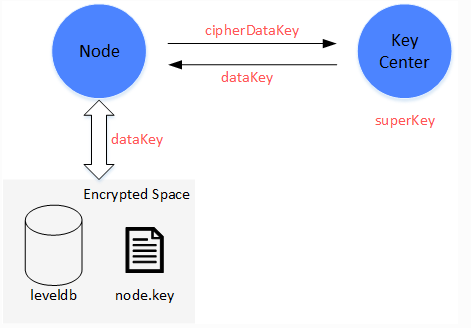

# 第二周周报

## fisco-bcos技术文档阅读
https://fisco-bcos-documentation.readthedocs.io/zh_CN/latest/index.html 

### 知识点一：落盘加密
主要目的：防止联盟之外的机构获取联盟链数据。

1. 描述：  
  在联盟链的架构中，机构和机构之间搭建一条区块链，数据在联盟链的各个机构内是可见的。

  在某些数据安全性要求较高的场景下，联盟内部的成员并不希望联盟之外的机构能够获取联盟链上的数据。此时，就需要对联盟链上的数据进行访问控制。  

  联盟链数据的访问控制，主要分为两个方面    
&emsp;&emsp;• 链上通信数据的访问控制   
&emsp;&emsp;• 节点存储数据的访问控制     
&emsp;&emsp;对于链上通信数据的访问控制，FISCO BCOS是通过节点证书和SSL来完成。此处主要介绍的是节点存储数据的访问控制，即落盘加密。   

&emsp;&emsp;&emsp;来自 <https://fisco-bcos-documentation.readthedocs.io/zh_CN/latest/docs/design/features/storage_security.html>

2. 主要思想：    
落盘加密是在机构内部进行的。在机构的内网环境中，每个机构独立地对节点的硬盘数据进行加密。当节点所在机器的硬盘被带离机构，并让节点在机构内网之外的网络启动，硬盘数据将无法解密，节点无法启动。进而无法盗取联盟链上的数据。

3. 方法架构：
落盘加密是在机构内部进行的，每个机构独立管理自己硬盘数据的安全。内网中，每个节点的硬盘数据是被加密的。所有加密数据的访问权限，通过Key Manager来管理。Key Manager是部署在机构内网内，专门管理节点硬盘数据访问秘钥的服务，外网无法访问。当内网的节点启动时，从Key Manager处获取加密数据的访问秘钥，来对自身的加密数据进行访问。

加密保护的对象包括：  
&emsp;&emsp;节点本地存储的数据库：leveldb    
&emsp;&emsp;节点私钥：node.key，gmnode.key（国密）

4. 具体实现：    
具体的实现过程，是通过节点自身持有的秘钥（dataKey）和Key Manager管理的全局秘钥（superKey）来完成的。

5. 节点:    
	&emsp;&emsp;• 节点用自己的dataKey，对自身加密的数据（Encrypted Space）进行加解密。  
	&emsp;&emsp;• 节点本身不会在本地磁盘中存储dataKey，而是存储dataKey被加密后的cipherDataKey。   
	&emsp;&emsp;• 节点启动时，拿cipherDataKey向Key Manager请求，获取dataKey。    
	&emsp;&emsp;• dataKey只在节点的内存中，当节点关闭后，dataKey自动丢弃。

6. Key Manager     
  持有全局的superKey，负责对所有节点启动时的授权请求进行响应，授权。     
  	&emsp;&emsp;• Key Manager必须实时在线，响应节点的启动请求。   
  	&emsp;&emsp;• 当节点启动时，发来cipherDataKey，Key Manager用superKey对cipherDataKey进行解密，若解密成功，就将节点的dataK返回给节点。   
  	&emsp;&emsp;• Key Manager只能在内网访问，机构内的外网无法访问Key Manager.  

### 知识点二：国密支持方案

为了充分支持国产密码学算法，金链盟基于国产密码学标准，实现了国密加解密、签名、验签、哈希算法、国密SSL通信协议，并将其集成到FISCO BCOS平台中，实现了对国家密码局认定的商用密码的完全支持。

国密版FISCO BCOS将交易签名验签、p2p网络连接、节点连接、数据落盘加密等底层模块的密码学算法均替换为国密算法，国密版FISCO BCOS与标准版主要特性对比如下：

### 知识点三：FISCO BCOS系统设计
**整体架构**  
整体架构上，FISCO BCOS划分成基础层、核心层、管理层和接口层：   
• 基础层:提供区块链的基础数据结构和算法库  
• 核心层: 实现了区块链的核心逻辑，核心层分为两大部分：   
&emsp;&emsp;1. 链核心层: 实现区块链的链式数据结构、交易执行引擎和存储驱动   
&emsp;&emsp;2. 互联核心层: 实现区块链的基础P2P网络通信、共识机制和区块同步机制   
• 管理层: 实现区块链的管理功能，包括参数配置、账本管理和AMOP      
• 接口层: 面向区块链用户，提供多种协议的RPC接口、SDK和交互式控制台    
FISCO BCOS基于多群组架构实现了强扩展性的群组多账本，基于清晰的模块设计，构建了稳定、健壮的区块系统。

**特点：群组架构**   
考虑到真实的业务场景需求，FISCO BCOS引入多群组架构，支持区块链节点启动多个群组，群组间交易处理、数据存储、区块共识相互隔离，保障区块链系统隐私性的同时，降低了系统的运维复杂度。

多群组架构中，群组间共享网络，通过网络准入和账本白名单实现各账本间网络消息隔离。

群组间数据隔离，每个群组独立运行各自的共识算法，不同群组可使用不同的共识算法。每个账本模块自底向上主要包括核心层、接口层和调度层三层，这三层相互协作，FISCO BCOS可保证单个群组独立健壮地运行。

• 核心层   
核心层负责将群组的区块数据、区块信息、系统表以及区块执行结果写入底层数据库。

存储分为世界状态(State)和分布式存储(AMDB)两部分，世界状态包括MPTState和StorageState，负责存储交易执行的状态信息，StorageState性能高于MPTState，但不存储区块历史信息；AMDB则向外暴露简单的查询(select)、提交(commit)和更新(update)接口，负责操作合约表、系统表和用户表，具有可插拔特性，后端可支持多种数据库类型，目前仅支持LevelDB数据库，后期会把基于mysql的AMDB集成到系统中。

• 接口层   
接口层包括交易池(TxPool)、区块链(BlockChain)和区块执行器(BlockVerifier)三个模块。    
• 交易池(TxPool): 与网络层以及调度层交互，负责缓存客户端或者其他节点广播的交易，调度层(主要是同步和共识模块)从交易池中取出交易进行广播或者区块打包；   
• 区块链(BlockChain): 与核心层和调度层交互，是调度层访问底层存储的唯一入口，调度层(同步、共识模块)可通过区块链接口查询块高、获取指定区块、提交区块；   
• 区块执行器(BlockVerifier): 与调度层交互，负责执行从调度层传入的区块，并将区块执行结果返回给调度层。
• 调度层
调度层包括共识模块(Consensus)和同步模块(Sync)。    
• **共识模块**：包括Sealer线程和Engine线程，分别负责打包交易、执行共识流程。Sealer线程从交易池(TxPool)取交易，并打包成新区块；Engine线程执行共识流程，共识过程会执行区块，共识成功后，将区块以及区块执行结果提交到区块链(BlockChain)，区块链统一将这些信息写入底层存储，并触发交易池删除上链区块中包含的所有交易、将交易执行结果以回调的形式通知客户端，目前FISCO BCOS主要支持PBFT和Raft共识算法；   
• **同步模块**：负责广播交易和获取最新区块， 考虑到共识过程中，leader负责打包区块，而leader随时有可能切换，因此必须保证客户端的交易尽可能发送到每个区块链节点，节点收到新交易后，同步模块将这些新交易广播给所有其他节点；考虑到区块链网络中机器性能不一致或者新节点加入都会导致部分节点区块高度落后于其他节点，同步模块提供了区块同步功能，该模块向其他节点发送自己节点的最新块高，其他节点发现块高落后于其他节点后，会主动下载最新区块。
