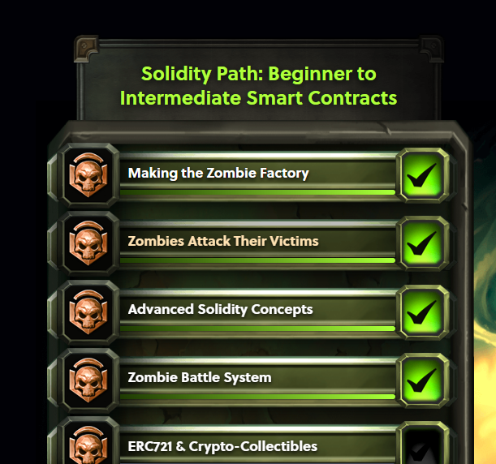
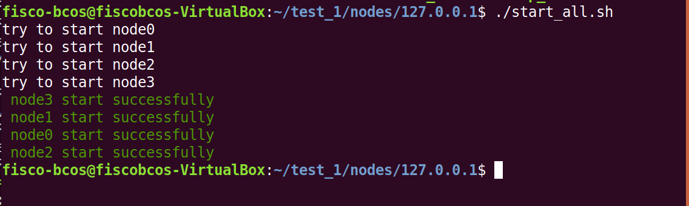
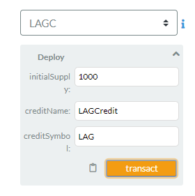
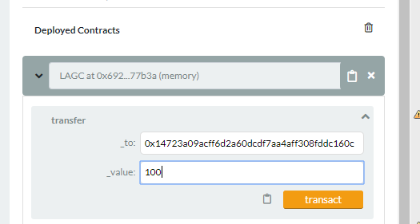
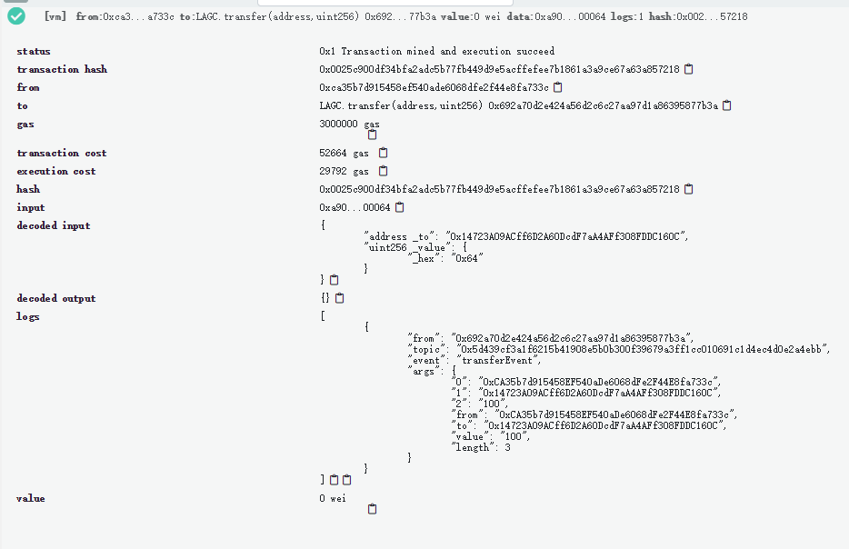
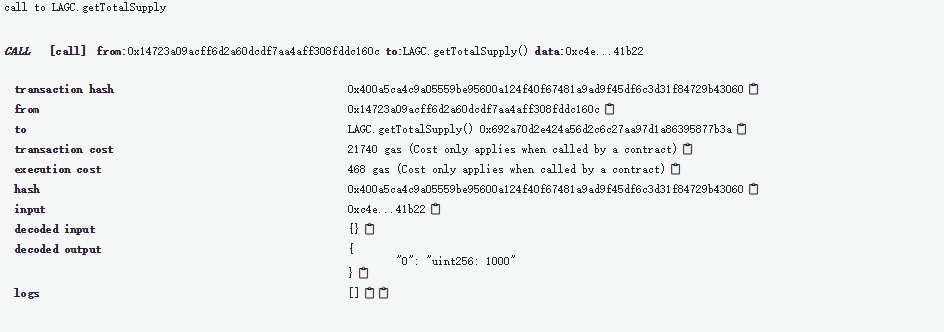
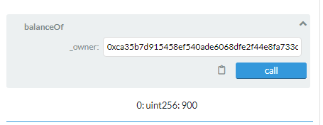
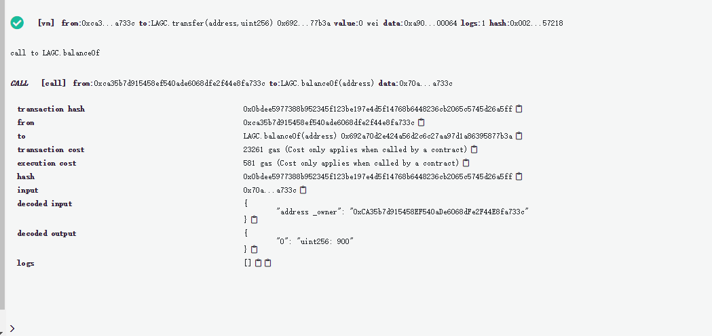

# 第四周周报

------

# 1. 石望华
### [**个人周报汇总**](../day2/石望华/石望华_周报_all_weeks.md)
### 6.17 周一

* 写代码，在remix上测试，写测试报告（见[《作业报告.md》](../day2/石望华/作业报告_day2_swhua.md))
* 在虚拟机上编译和部署合约，问了老师，最终还是没成功，说是缺少.class文件，但直接javac编译java文件会产生很多错误，而且我将合约转成java文件时也有报与abi相关的错误，但生成了java文件

### 6.18 周二

* 结合Spring-Boot项目和AssetAPP应用，学习官方文档的Web3SDK（主要是配置SDK和使用SDK），“使用SDK” 部分主要讲的是Spring项目下调用SDK API、创建账号和部署、调用合约，而没有讲SpringBoot项目的开发；了解了Web3SDK API, 做笔记于《FISCO-BCOS文档学习_2.0.md》。
* 上午根据SpringBootStarter的REAADME_CN.md进行部署时，在“运行”一步“./gradlew build”命令就没运行成功了，问了老师好久，检查了各种地方，最后发现是因为gradlew是windows下的格式，通过dos2unix转成unix下的格式就运行成功了......
* 熟悉Spring-Boot项目结构（主要是src（main和test）、各种gradle），认真阅读了main下的8个java类文件
* 部署groovy环境（springboot里有.groovy文件）

### 6.19 周三

* 学git，clone仓库并成功commit、push到远程仓库（之前一直是在网页web端直接修改contributions）
* 继续读spring-boot的源码（今天读的主要是test目录下的5个java类文件），发现对合约的部署与调用是在/src/test部分而不是/src/main部分，而用spring实现的asset-app中是在/src/main下的一个AssetClient类中实现的！
* 而且在spring项目中没有看到**.bin**文件和**.abi**文件，在spring-boot中这两种格式的文件在将**.sol**合约文件转化为.java文件的类SolidityFunctionWrapperGeneratorTest中有用到，而在spring中是通过console的脚本文件sol2java.sh进行编译生成的，也许这是两种合约文件编译为java文件的方式。（但本质应该相同，因为通过脚本编译后会生成.abi和.bin，只是对用户透明了）
* 运行spring-boot项目还是有问题

### 6.20 周四

* 根据《DAY2-3.实验要求》里的代码写**ShopClient.java**类和**UserKeyutil.java**类，并在**ContractTest.java**里加入了相应的测试代码

* 虚拟机里又出现了文件不能共享的问题（第三次），这次又花了较长时间实现文件共享（尝试了各种命令），并将命令记录在了《commands_record.md》
* 在windows下的IDEA里写好代码后在虚拟机里./gradlew build, 产生一堆bugs，一个个解决，最终还剩一两个。

### 6.21 周五

* 继续改代码，debug（import包，日志处理，加注解等）
* 熟悉spring与springboot（通过发现它们的不同）
* 写[《作业报告.md》](../day2/石望华/作业报告_day2_swhua.md)
------

------

# 2. 李冠海

## 周一   
学习spring和spring-boot，为实验做准备。[在Remmix上用solidity编写积分系统的智能合约](../day2/李冠海/LAGCredit.sol)，[并将其转换为java类](../day2/李冠海/LAGCredit.java)。    
## 周二   
[下载idea，搭好spring-boot开发环境，下载spring-boot-starter项目，导入idea，将智能合约转换后的java类复制到项目中，编写配置、服务类，进行测试](../day2/李冠海/homework_sprint_boot_starter.md)。    
## 周三   
阅读FISCO-BCOS的文档，根据[文档](https://fisco-bcos-documentation.readthedocs.io/zh_CN/latest/docs/browser/browser.html)搭建区块链浏览器，并[使用浏览器查看区块、节点信息](../day2/李冠海/blockchain_browser_usage.md)。    
## 周四~周五    
阅读FISCO-BCOS的文档，根据[文档](https://fisco-bcos-documentation.readthedocs.io/zh_CN/latest/docs/tutorial/sdk_application.html)搭建一个区块链应用：[在一台机器上部署节点和合约，并在另一台机器上通过SDK开发一个可以调用合约的JavaFX应用](../day2/李冠海/asset_app.md)。

------
------

# 3. 贾学雨

## 周一 （2019/6/17）

#### 继续完成[僵尸游戏](https://cryptozombies.io/)的章节练习，熟悉solidity语法。

- #### 搭建僵尸工厂

- #### 僵尸攻击人类

- #### 高级solidity理论

## 周二 （2019/6/18）

#### 学习spring和spring boot的知识，为后面使用spring-boot-starter做准备。并了解和学习spring-boot-starter的结构和文件源码。

## 周三 （2019/6/19）

#### 下载IntelliJ IDEA,利用官方文档提供的spring-boot-starter开始开发LAGC书店积分系统。编写服务和测试，运行项目并debug。

## 周四 （2019/6/20）

- #### 继续周三的spring-boot-starter项目开发测试，并最终[完成测试](https://github.com/blockchaingroup4/webank/blob/master/day2/%E8%B4%BE%E5%AD%A6%E9%9B%A8/LAGC%E7%A7%AF%E5%88%86%E7%B3%BB%E7%BB%9F%E9%83%A8%E7%BD%B2.md)。

- #### 阅读FISCO-BCOS官方文档的[构建第一个区块链应用](https://fisco-bcos-documentation.readthedocs.io/zh_CN/latest/docs/tutorial/sdk_application.html),并参照案例的asset-app完成LAG-app书店积分系统开发。

## 周五 （2019/6/21）

#### 继续开发LAG-app。这里最难处理的就是业务开发，因为asset-app和LAG-app的业务不用，所以很大程度上我需要重新开发业务。最终完成业务开发。并修改调用业务的脚本，最终完成LAG-app的开发。

------

------

# 4.陈思源
## 合约讲解
### 安全性：
	在你把智能协议传上以太坊之后，它就变得不可更改, 这种永固性意味着你的代码永远不能被调整或更新。
	如果你的智能协议有任何漏洞，即使你发现了也无法补救。你只能让你的用户们放弃这个智能协议，然后转移到一个新的修复后的合约上。

### modifier 函数修饰符
	声明：
	modifier onlyOwner() {
		require(msg.sender == owner);
		_;
	}
	调用：
	function likeABoss() external onlyOwner {
		LaughManiacally("Muahahahaha");
	}
	注：先执行onlyOwner以检查，再执likeABoss函数内部代码。

  ### gas:     
    用户想要每次执行你的 DApp 都需要支付一定的 gas。
	功能逻辑越复杂，消耗gas越多。
	强调优化。
	结构封装 （Struct packing）可用于节省gas：
		当 uint 定义在一个 struct 中的时候，尽量使用最小的整数子类型以节约空间。 并且把同样类型的变量放一起（即在 struct 中将把变量按照类型依次放置），这样 Solidity 可以将存储空间最小化

### 带参数的函数修饰符
	函数修饰符里面可以带有参数
	// 存储用户年龄的映射
	mapping (uint => uint) public age;
	// 限定用户年龄的修饰符
	modifier olderThan(uint _age, uint _userId) {
		require(age[_userId] >= _age);
		 _;
	}
	// 必须年满16周岁才允许开车 (至少在美国是这样的).
	// 我们可以用如下参数调用`olderThan` 修饰符:
	function driveCar(uint _userId) public olderThan(16, _userId) {
	// 其余的程序逻辑
	}

### View函数不花费gas
	view 函数不会真正改变区块链上的任何数据 - 它们只是读取。
	在所能只读的函数上标记上表示“只读”的“external view 声明，就能为用户减少在 DApp 中 gas 用量。

### 存储昂贵
	Solidity 使用storage(存储)是相当昂贵的，”写入“操作尤其贵。
	使用一个标记了external view的函数，遍历比 storage 要便宜太多，因为 view 函数不会产生任何花销。
	在数组后面加上 memory关键字， 表明这个数组是仅仅在内存中创建，不需要写入外部存储，并且在函数调用结束时它就解散了。
	内存运算可以大大节省gas开销
	function getArray() external pure returns(uint[]) {
		// 初始化一个长度为3的内存数组
		uint[] memory values = new uint;
		// 赋值
		values.push(1);
		values.push(2);
		values.push(3);
		// 返回数组
		return values;
	}

### payable 修饰符
	contract OnlineStore {
		function buySomething() external payable {
		// 检查以确定0.001以太发送出去来运行函数:
		require(msg.value == 0.001 ether);
		// 如果为真，一些用来向函数调用者发送数字内容的逻辑 transferThing(msg.sender);
		}
	}
	ether 是一个內建单元（就是货币的单位）
	如果一个函数没标记为payable， 而你尝试利用上面的方法发送以太，函数将拒绝你的事务。

### 提现
	主要是用transfer函数
	contract GetPaid is Ownable {
		function withdraw() external onlyOwner {
		owner.transfer(this.balance);
		}
	}

### 随机数
	简单的生成随机数的方法是不安全的。

## 生成代码

### zombieattack.sol   
      pragma solidity ^0.4.19;

      import "./zombiehelper.sol";

      contract ZombieBattle is ZombieHelper {
        uint randNonce = 0;
        uint attackVictoryProbability = 70;

        function randMod(uint _modulus) internal returns(uint) {
          randNonce++;
          return uint(keccak256(now, msg.sender, randNonce)) % _modulus;
        }

        function attack(uint _zombieId, uint _targetId) external ownerOf(_zombieId) {
          Zombie storage myZombie = zombies[_zombieId];
          Zombie storage enemyZombie = zombies[_targetId];
          uint rand = randMod(100);
          if (rand <= attackVictoryProbability) {
            myZombie.winCount++;
            myZombie.level++;
            enemyZombie.lossCount++;
            feedAndMultiply(_zombieId, enemyZombie.dna, "zombie");
            } // 在这里开始
          }
        }

### zombiesfactory.sol

      pragma solidity ^0.4.19;

      import "./ownable.sol";

      contract ZombieFactory is Ownable {

    event NewZombie(uint zombieId, string name, uint dna);

    uint dnaDigits = 16;
    uint dnaModulus = 10 ** dnaDigits;
    uint cooldownTime = 1 days;

    struct Zombie {
      string name;
      uint dna;
      uint32 level;
      uint32 readyTime;
    }

    Zombie[] public zombies;

    mapping (uint => address) public zombieToOwner;
    mapping (address => uint) ownerZombieCount;

    function _createZombie(string _name, uint _dna) internal {
        uint id = zombies.push(Zombie(_name, _dna, 1, uint32(now + cooldownTime))) - 1;
        zombieToOwner[id] = msg.sender;
        ownerZombieCount[msg.sender]++;
        NewZombie(id, _name, _dna);
    }

    function _generateRandomDna(string _str) private view returns (uint) {
        uint rand = uint(keccak256(_str));
        return rand % dnaModulus;
    }

    function createRandomZombie(string _name) public {
        require(ownerZombieCount[msg.sender] == 0);
        uint randDna = _generateRandomDna(_name);
        randDna = randDna - randDna % 100;
        _createZombie(_name, randDna);
    }

    }

### zombiefeeding.sol
      pragma solidity ^0.4.19;

    import "./zombiefactory.sol";

    contract KittyInterface {
      function getKitty(uint256 _id) external view returns (
        bool isGestating,
        bool isReady,
        uint256 cooldownIndex,
        uint256 nextActionAt,
        uint256 siringWithId,
        uint256 birthTime,
        uint256 matronId,
        uint256 sireId,
        uint256 generation,
        uint256 genes
        );
      }

      contract ZombieFeeding is ZombieFactory {

        KittyInterface kittyContract;

        modifier ownerOf(uint _zombieId) {
          require(msg.sender == zombieToOwner[_zombieId]);
          _;
        }

        function setKittyContractAddress(address _address) external onlyOwner {
          kittyContract = KittyInterface(_address);
        }

        function _triggerCooldown(Zombie storage _zombie) internal {
          _zombie.readyTime = uint32(now + cooldownTime);
        }

        function _isReady(Zombie storage _zombie) internal view returns (bool) {
          return (_zombie.readyTime <= now);
        }

        function feedAndMultiply(uint _zombieId, uint _targetDna, string _species) internal ownerOf(_zombieId) {
          Zombie storage myZombie = zombies[_zombieId];
          require(_isReady(myZombie));
          _targetDna = _targetDna % dnaModulus;
          uint newDna = (myZombie.dna + _targetDna) / 2;
          if (keccak256(_species) == keccak256("kitty")) {
            newDna = newDna - newDna % 100 + 99;
          }
          _createZombie("NoName", newDna);
          _triggerCooldown(myZombie);
        }

        function feedOnKitty(uint _zombieId, uint _kittyId) public {
          uint kittyDna;
          (,,,,,,,,,kittyDna) = kittyContract.getKitty(_kittyId);
          feedAndMultiply(_zombieId, kittyDna, "kitty");
        }
      }
### ZombieHelper.sol
      pragma solidity ^0.4.19;

      import "./zombiefeeding.sol";

      contract ZombieHelper is ZombieFeeding {

        uint levelUpFee = 0.001 ether;

        modifier aboveLevel(uint _level, uint _zombieId) {
          require(zombies[_zombieId].level >= _level);
          _;
        }

        function withdraw() external onlyOwner {
          owner.transfer(this.balance);
        }

        function setLevelUpFee(uint _fee) external onlyOwner {
          levelUpFee = _fee;
        }

        function changeName(uint _zombieId, string _newName) external aboveLevel(2, _zombieId) ownerOf(_zombieId) {
          zombies[_zombieId].name = _newName;
        }

        function changeDna(uint _zombieId, uint _newDna) external aboveLevel(20, _zombieId) ownerOf(_zombieId) {
          zombies[_zombieId].dna = _newDna;
        }

        function getZombiesByOwner(address _owner) external view returns(uint[]) {
          uint[] memory result = new uint;
          uint counter = 0;
          for (uint i = 0; i < zombies.length; i++) {
            if (zombieToOwner[i] == _owner) {
              result[counter] = i;
              counter++;
            }
          }
          return result;
        }

      }

## remix 测试
### 合约编写
    pragma solidity ^0.4.25;
      //积分系统

      contract LAGC{
        //1. 积分发行常量初始化
        string name = "LAGC";  // 积分名称 LIBRAIRIE AVANT-GARDE CREDIT
        string symbol = "LAG"; // 积分简称
        uint256 totalSupply; // 发行量

        // 地址对应余额
        mapping (address => uint256) public balances;
        // 用来通知客户端积分交易发生
        event transferEvent(address from, address to, uint256 value);

        // 构造函数，由积分创建者执行：书店
        constructor(uint256 initialSupply, string creditName, string creditSymbol) public {
          //initialSupply:初始积分
          //creditName：积分名称
          //creditSymbol：积分简称
          totalSupply = initialSupply;
          balances[msg.sender] = totalSupply;
          name = creditName;
          symbol = creditSymbol;

        }

        // 查询积分发放总额
        function getTotalSupply() constant returns (uint256) {
          return totalSupply;

        }

        // 积分的发送函数，内部函数
        function _transfer(address _from, address _to, uint _value) internal {
          require(_to != 0x0);
          require(balances[_from] >= _value);
          require(balances[_to] + _value > balances[_to]); //_value不能为负值
          uint previousBalances = balances[_from] + balances[_to];
          balances[_from] -= _value; balances[_to] += _value;
          transferEvent(_from, _to, _value);   // 记录转账并通知客户端发生积分交易
          assert(balances[_from] + balances[_to] == previousBalances);  
        }

        // 客户端调用的积分发送函数
        function transfer(address _to, uint256 _value) public {
          _transfer(msg.sender, _to, _value);
        }

        // 查询账户余额
        function balanceOf(address _owner) constant returns (uint256) {
          return balances[_owner];

        }

      }
  #### 启动节点

#### 初始化

#### 转账

#### 查询发放总额

#### 查询余额

------

------

# 5.张羽颀
### 周一
完成课程实验的图书积分系统的代码编写
### 周二
根据fisco-bcos上的控制台教程，部署区块链并调用控制台的合约编译工具，将合约编译成java文件 。
首先使用控制台部署周一时完成的合约，然后尝试运行合约内的方法。完成了转账等操作。
### 周三
根据fisco-bcos技术文档里的教程"构建第一个区块链应用"，利用编译好的图书积分系统合约文件，并根据教程利用已有的web3SDK开发第一个区块链应用
### 周四
学习spring和spring-boot框架，回顾Web3SDK的使用，为后续的开发做准备
### 周五
学习区块链浏览器，并学习反向代理nginx服务器配置，前端开发vue-cli等的使用，为之后的大作业前端开发打下基础

------
------
